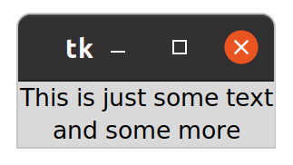
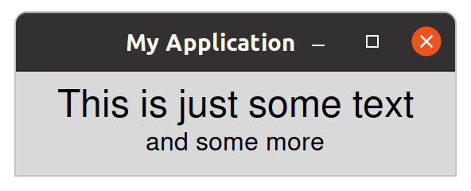
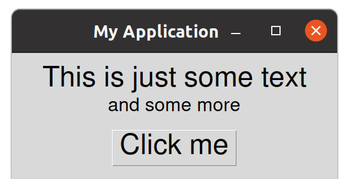
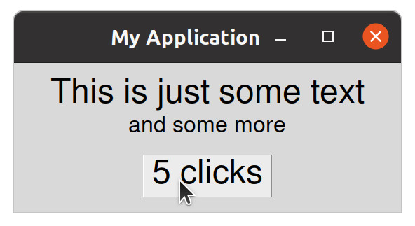
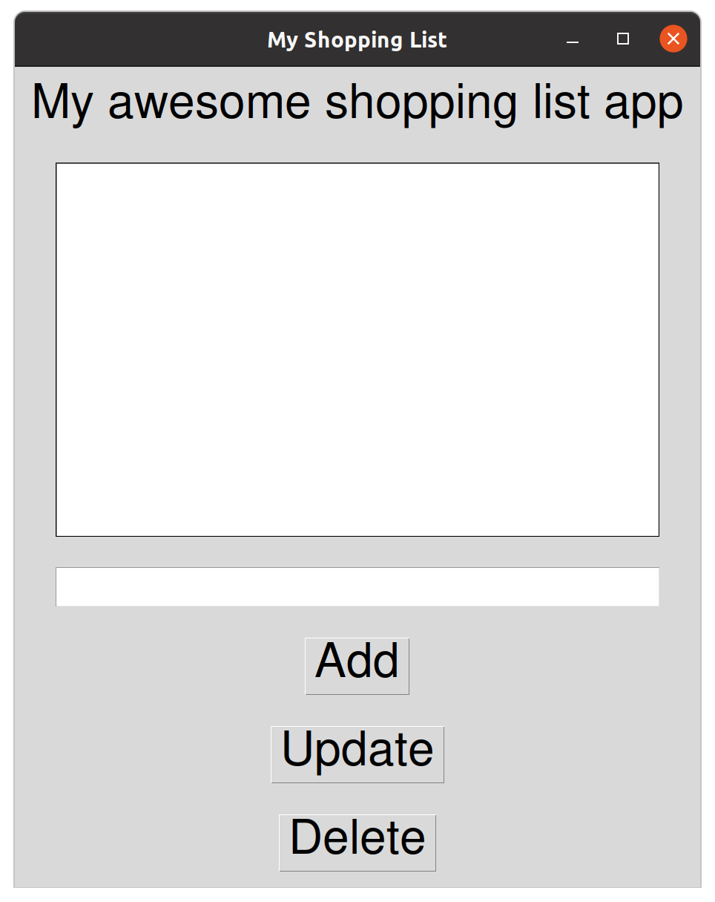
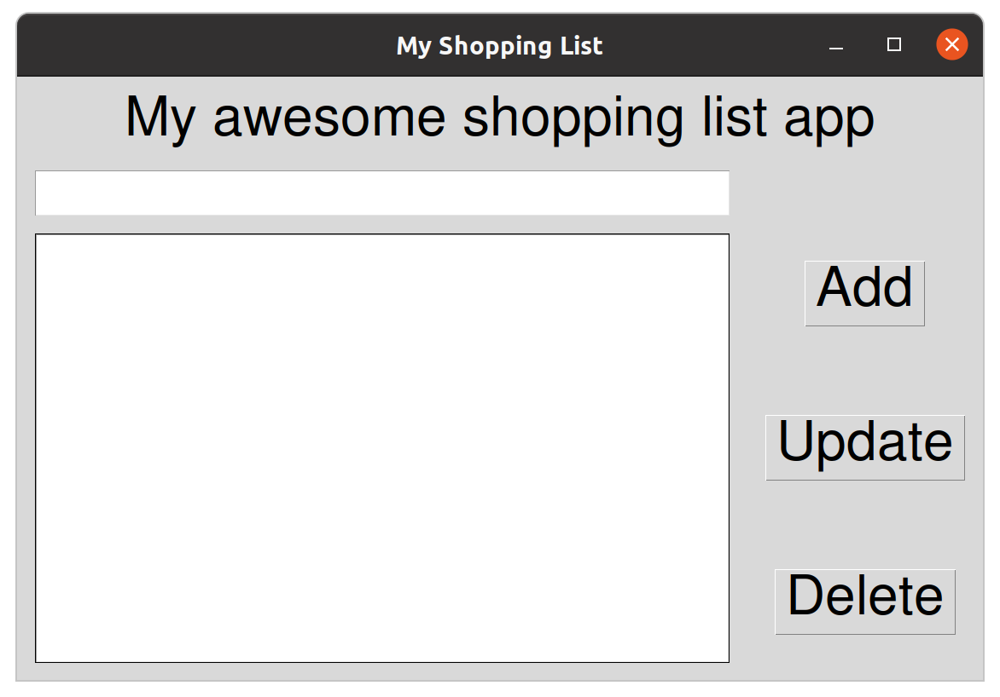
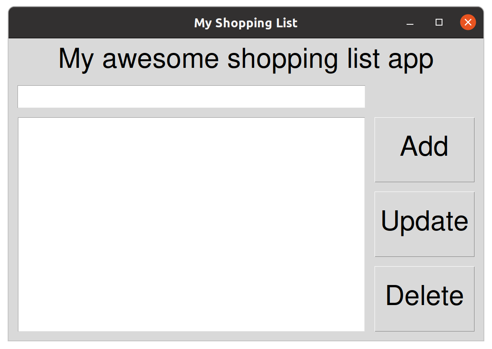
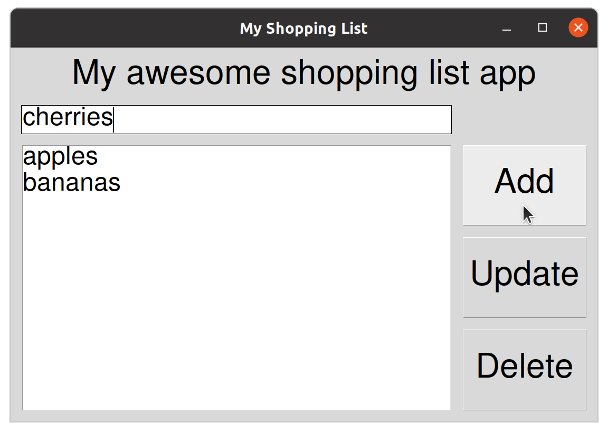

# Lab_04: Introduction to tkinter

In this lab session we will play with [tkinter](https://docs.python.org/3/library/tkinter.html), a graphical user interface (GUI) toolkit originally designed for the Tcl language.
The official python documentation is not great for learning `tkinter`. More useful documentation can be found [here](https://anzeljg.github.io/rin2/book2/2405/docs/tkinter/index.html). 


>If you want to explore the tkinter system further then [the tk-tutorial](https://tk-tutorial.readthedocs.io/en/latest/index.html) is very good.

`tkinter` will allow us to build complex GUI's very easily. 
However, it won't do the **design work** for us. 
We need to design our interface first and then implement the design using `tkinter`.
This means understanding exactly where we want our widgets to appear.


To use tkinter, we first need to import it.
A common convention is to rename the module as `tk` to keep the name short, as it may be used a lot.

```python
import tkinter as tk
```

Then we will need a top-level window to contain our interface.
We do this by inheriting from `tk.Tk`.

```python
import tkinter as tk

class MyApplication(tk.Tk):
    def __init__(self):
        super().__init__()
        # add and position `widgets` here
```

>We could have inherited from `tk.Frame` or from nothing at all. 
Using `tk.Tk` as the basis for simple apps makes things a little easier.

Our class now *is* a tk.Tk object.
But this code doesn't yet contain anything visible.

## Labels

We need to add some widgets.
So lets add some simple `tkinter.Label` widgets.
Labels just present text.

```python
import tkinter as tk

class MyApplication(tk.Tk):
    def __init__(self):
        super().__init__()
        self.intro1 = tk.Label(text="This is just some text")
        self.intro2 = tk.Label(text="and some more")
        self.intro1.grid()
        self.intro2.grid()
```

Notice we specify the `text` as an argument when we create a `tk.Label` instance.
We also need to call `grid()` on each label in order to register it with the `grid` geometry manager.
We will use the `grid` geometry manager throughout this lab to position all our widgets.

At the end of our script, we can now actually create an instance and start the tkinter main loop like this.

```python
app = MyApplication()
app.mainloop()
```

This results in a simple application window with two labels.



>Your window manager may produce a different, but similar result.

### A bit more style

Our application looks a bit basic and has the default title 'tk'. 
We can set the title of the main window by calling `self.title` and passing in the string we want to be displayed.

There are many ways to add some style. 
We can add some padding around the labels by passing keyword arguments to `grid`.
Usually, layout is handled by these `grid` calls.

We can also choose the fonts to be used as an argument to the `tk.Label` constructor.

Here's an upgraded example.

```python
import tkinter as tk

small = ('Helvetica', 12)
large = ('Helvetica', 18)

class MyApplication(tk.Tk):
    def __init__(self):
        super().__init__()
        self.title('My Application')
        self.intro1 = tk.Label(text="This is just some text", font=large)
        self.intro2 = tk.Label(text="and some more", font=small)
        self.intro1.grid(pady=(20, 0), padx=50)
        self.intro2.grid(pady=(0, 20))

app = MyApplication()
app.mainloop()
```

We declared some variables to hold the font values.
Fonts are set as two-tuples containing the font-family name and the font size.

>Notice we set `padx` to a single value, `50` which is applied left and right but we set `pady` to a two-element tuple representing top and bottom padding.




>Other useful keywords for styling are `fg` and `bg` which are used to set the foreground colour (i.e. the text colour) and the background colour.

>Try experimenting with different values for padding, font size, colours and so on.

## Buttons

Buttons are easy enough.
The only thing to remember is to add a `command` argument.
This can be set to any function or method (anything `callable`).
Buttons will call their `command` when they are clicked.


```python
import tkinter as tk

small = ('Helvetica', 12)
large = ('Helvetica', 18)

class MyApplication(tk.Tk):
    def __init__(self):
        super().__init__()
        self.title('My Application')
        self.intro1 = tk.Label(text="This is just some text", font=large)
        self.intro2 = tk.Label(text="and some more", font=small)
        self.intro1.grid(pady=(20, 0), padx=50)
        self.intro2.grid()
        self.btn = tk.Button(text="Click me", font=large, command=self.clicked)
        self.btn.grid(pady=20)

    def clicked(self):
        print("I was clicked!!")

app = MyApplication()
app.mainloop()

```

The resulting application looks like this.



Clicking the button now calls our `clicked` method which simply prints a message to the console.

We can make the button do anything.
Perhaps it's more useful to count how many clicks have occurred and to display the number by updating the button text.

```python
import tkinter as tk

small = ('Helvetica', 12)
large = ('Helvetica', 18)

class MyApplication(tk.Tk):
    def __init__(self):
        super().__init__()
        self.title('My Application')
        self.intro1 = tk.Label(text="This is just some text", font=large)
        self.intro2 = tk.Label(text="and some more", font=small)
        self.intro1.grid(pady=(20, 0), padx=50)
        self.intro2.grid()
        self.btn = tk.Button(text="Click me", font=large, command=self.clicked)
        self.btn.grid(pady=20)
        self.count = 0

    def clicked(self):
        self.count += 1
        self.btn.configure(text=f'{self.count} clicks')

app = MyApplication()
app.mainloop()
```

We can update widget configuration at any time using the generic widget [configure](https://anzeljg.github.io/rin2/book2/2405/docs/tkinter/universal.html) method.




Clicking on the button will now update the button text to reflect the click count.

## Listbox and entry widgets

The `tk.Listbox` widget holds a list of strings.
Obviously, this is a great candidate for creating a user interface for our shopping list application.

To get information into our application, we need a `tk.Entry` widget.

>See documentation on the [tk.Listbox](https://anzeljg.github.io/rin2/book2/2405/docs/tkinter/listbox.html) and [tk.Entry](https://anzeljg.github.io/rin2/book2/2405/docs/tkinter/entry.html) widgets.

We are imagining an application where the user can manage a list.
The user must be able to enter text and click an 'add' button to add a new item to the list.
We also want to allow the user to select an item in the list and to update or delete the selected item by clicking either the 'update' or 'delete' button.

So, we need:

- a label with the application title
- a listbox, containing our items
- an entry field for specifying new and updated items
- an 'add' button
- an 'update' button
- a 'delete' button

First, let's just add the widgets into our application.

```python
import tkinter as tk

small = ('Helvetica', 18)
large = ('Helvetica', 24)

class ShoppingList(tk.Tk):
    def __init__(self):
        super().__init__()
        self.title('My Shopping List')

        # create widgets
        self.label = tk.Label(text='My awesome shopping list app', font=large)
        self.list = tk.Listbox(selectmode=tk.SINGLE, font=small, width=30)
        self.entry = tk.Entry(font=small, width=30)
        self.add_btn = tk.Button(text="Add", font=large)
        self.update_btn = tk.Button(text="Update", font=large)
        self.delete_btn = tk.Button(text="Delete", font=large)

        # position widgets
        self.label.grid(padx=20, pady=20)
        self.list.grid(padx=20, pady=20)
        self.entry.grid(padx=20, pady=20)
        self.add_btn.grid(padx=20, pady=20)
        self.update_btn.grid(padx=20, pady=20)
        self.delete_btn.grid(padx=20, pady=20)

app = ShoppingList()
app.mainloop()
```

>Notice we have changed the name of the application.

We have reorganised our code so that widget creation all happens at once and the layout code is grouped together.
This will help us to think about positioning the elements separately from creating them.

We have updated the font sizes and chosen fonts for each of the different widgets (you can experiment with this) and we have set the `width` argument for the `tk.Entry` and the `tk.Listbox`.
>The `width` for these widgets is specified in characters, not pixels.

We also specified the `selectmode` for the `Listbox` so that only one item can be selected at a time.

In terms of layout, we have added 20px of padding around each widget.



## Layout using `grid()`

OK, we have all the necessary widgets.
Notice that by default, they appear in one column and are placed in the order of creation, with a new row being created for each widget.

The `tk.Listbox` widget has been given 10 rows by default so it is much taller than the other widgets.
>You can change this by setting the `height` argument.

Our widgets are not arranged in a very intuitive way.
We need five rows and two columns.

<table style="text-align: center; min-width: 400px">
    <tr>
        <td colspan=2>Label</td>
    </tr>
    <tr>
        <td>Entry</td>
        <td></td>
    </tr>
    <tr>
        <td rowspan=3 style="min-width: 220px;">Listbox</td>
        <td>Button</td>
    </tr>
    <tr>
        <td>Button</td>
    </tr>
    <tr>
        <td>Button</td>
    </tr>
</table>

For this, we need to specify the `column` and the `row` when we call `grid()` on each widget.
We will also set our `Label` to span two columns (`columnspan=2`) and our `Listbox` to span three rows (`rowspan=3`).

| widget        | row | column | rowspan | columnspan |
|:--------------|:---:|:------:|:-------:|:----------:|
| label         | 0   | 0      | -       | 2          |
| entry         | 1   | 0      | -       | -          |
| listbox       | 2   | 0      | 3       | -          |
| add button    | 2   | 1      | -       | -          |
| update button | 3   | 1      | -       | -          |
| delete button | 4   | 1      | -       | -          |


This translates to changes in the layout code as follows:

```python
import tkinter as tk

small = ('Helvetica', 12)
large = ('Helvetica', 18)

class ShoppingList(tk.Tk):
    def __init__(self):
        super().__init__()
        self.title('My Shopping List')

        # create widgets
        self.label = tk.Label(text='My awesome shopping list app', font=large)
        self.list = tk.Listbox(selectmode=tk.SINGLE, font=small, width=30)
        self.entry = tk.Entry(font=large, width=30)
        self.add_btn = tk.Button(text="Add", font=large)
        self.update_btn = tk.Button(text="Update", font=large)
        self.delete_btn = tk.Button(text="Delete", font=large)

        # position widgets
        self.label.grid(padx=20, pady=20, row=0, column=0, columnspan=2)
        self.entry.grid(padx=20, row=1, column=0)
        self.list.grid(padx=20, pady=20, row=2, column=0, rowspan=3)
        self.add_btn.grid(padx=20, pady=20, row=2, column=1)
        self.update_btn.grid(padx=20, pady=20, row=3, column=1)
        self.delete_btn.grid(padx=20, pady=20, row=4, column=1)

app = ShoppingList()
app.mainloop()
```

You should be able to see that we have set the `row` and `column` arguments to `grid()` to the appropriate values for each widget.
We also set `columnspan` and `rowspan` accordingly.
Make sure you understand what happened here.

>Notice, I also removed the top/bottom padding from the entry widget to make it sit between the label and the listbox padding.
Obviously, you can experiment to make it look however you want.



Finally, we can tweak the layout of each widget by specifying how each should fill the space provided by the grid cell(s) it occupies.
A common way to do this is to set the `sticky` argument.

In this case, we want the buttons to fill their containers.
To do this, we specify that they should `stick` to the north, south, east and west edges of their container.
In all cases, set `sticky="nsew"`.

```python
import tkinter as tk

small = ('Helvetica', 18)
large = ('Helvetica', 24)

class ShoppingList(tk.Tk):
    def __init__(self):
        super().__init__()
        self.title('My Shopping List')

        # create widgets
        self.label = tk.Label(text='My awesome shopping list app', font=large)
        self.list = tk.Listbox(selectmode=tk.SINGLE, font=small, width=30)
        self.entry = tk.Entry(font=small, width=30)
        self.add_btn = tk.Button(text="Add", font=large)
        self.update_btn = tk.Button(text="Update", font=large)
        self.delete_btn = tk.Button(text="Delete", font=large)

        # position widgets
        self.label.grid(padx=20, pady=20, row=0, column=0, columnspan=2)
        self.entry.grid(padx=20, row=1, column=0)
        self.list.grid(padx=20, pady=20, row=2, column=0, rowspan=3)
        self.add_btn.grid(sticky="nsew", padx=(0, 20), pady=20, row=2, column=1)
        self.update_btn.grid(sticky="nsew", padx=(0, 20), row=3, column=1)
        self.delete_btn.grid(sticky="nsew", padx=(0, 20), pady=20, row=4, column=1)

app = ShoppingList()
app.mainloop()
```

>Notice I tweaked the padding again to remove the top/bottom padding from the middle button and to remove the left padding from all the buttons.

The final layout is like this:




## Activating the Entry widget

Now we have our layout finalised, we can work on making the application do something useful.
The core user interactions will involve entering text into the entry widget, selecting items in the list and clicking the buttons. 

In order to make accessing the data from an entry widget easy, we need to specify a `tk.stringVar` which can be read from and written to.

Add the following into our `__init__` method.
Make sure to run this code before the `tk.Entry` widget is created.

```python
# the current/new item
self.item = tk.StringVar()
```

Now we can update our `tk.Entry` widget to use our variable like this.

```python
self.entry = tk.Entry(font=large, width=30, textvariable=self.item)
```

This will allow us to access the text in the entry more easily.

>The `tk.StringVar` (and equivalent numeric values) system is useful when different widgets need to share the same data.
>
>In this case it provides us with an easy way to read the data from the entry widget.
>```python
>entered_text = self.item.get()
>```
>and write data back to the widget
>```python
>self.item.set("Some value")
>```

## Activating the buttons

Now we can activate each button in turn.
To do this we will specify a `command` which will be called when the button is pressed.
We can set the command when we create the buttons.


### The 'Add' button

First we will need to add items to our list.

Now we can add a method to take the value from the Entry (via `self.item`) and add it into the listbox.

```python
def add(self):
    """Add the current entry text (if there is some) to the list"""
    item = self.item.get()
    if item:
        self.list.insert(tk.END, item)
        self.item.set("")
```

Study the above code.
We are getting the text from the `tk.Entry` widget.
If it's an empty string, we ignore it and do nothing.
If it has a value, we call the `tk.Listbox.insert()` method to add our value to the end of the list.
We then set the `tk.Entry` value to an empty string to clear the added value from entry widget.

So far, this new `add` method will never be called.
So we update the add button by adding a `command` argument.

```python
self.add_btn = tk.Button(text="Add", font=large, command=self.add)
```

This means that clicking the add button will now call our function. 

The final code looks like this:

```python
import tkinter as tk

small = ('Helvetica', 18)
large = ('Helvetica', 24)

class ShoppingList(tk.Tk):
    def __init__(self):
        super().__init__()
        self.title('My Shopping List')

        # the current/new item
        self.item = tk.StringVar()

        # create widgets
        self.label = tk.Label(text='My awesome shopping list app', font=large)
        self.list = tk.Listbox(selectmode=tk.SINGLE, font=small, width=30)
        self.entry = tk.Entry(font=small, width=30, textvariable=self.item)
        self.add_btn = tk.Button(text="Add", font=large, command=self.add)
        self.update_btn = tk.Button(text="Update", font=large)
        self.delete_btn = tk.Button(text="Delete", font=large)

        # position widgets
        self.label.grid(padx=20, pady=20, row=0, column=0, columnspan=2)
        self.entry.grid(padx=20, row=1, column=0)
        self.list.grid(padx=20, pady=20, row=2, column=0, rowspan=3)
        self.add_btn.grid(sticky="nsew", padx=(0, 20), pady=20, row=2, column=1)
        self.update_btn.grid(sticky="nsew", padx=(0, 20), row=3, column=1)
        self.delete_btn.grid(sticky="nsew", padx=(0, 20), pady=20, row=4, column=1)

    def add(self):
        """Add the current entry text (if there is some) to the list"""
        item = self.item.get()
        if item:
            self.list.insert(tk.END, item)
            self.item.set("")

app = ShoppingList()
app.mainloop()
```

Now you should be able to add items to the list using the entry and the add button.



### The 'Delete' button

Now, let's update the delete button to call a new `delete` method.

```python
self.delete_btn = tk.Button(text="Delete", font=large, command=self.delete)
```

Obviously, we need to define the new method.
The method needs to detect which list item is selected and to delete the appropriate item from the list.

```python
def delete(self):
    """Delete the currently selected item (if there is one)"""
    index = self.list.curselection()
    if index:
        self.list.delete(index[0])
```

Here we are using the `Listbox.curselection()` method.
This will return a `tuple` containing the indices of all selected items.
In our case, because we specified `selectmode=tk.SINGLE`, we know that this will either be empty or will contain a single value.
So we check first, to make sure we have an item selected before calling the `Listbox.delete()` method which does the job of removing the selected item from the listbox.

>When we have an item selects, the result of `Listbox.curselection()` is something like `(2,)` - i.e. a tuple, with a single element.
This is why we need to extract the actual `integer` (2) from the `tuple` using square bracket notation.

Try adding a few items to the list and delete specific items.
You should see that the selected item is always deleted.

### The 'Update' button

Now, let's call a new `update` method from the update button `command`.

```python
self.update_btn = tk.Button(text="Update", font=large, command=self.update)
```

The `update` method needs to read the value from the entry widget, detect which list item is selected and to update the appropriate item in the listbox with the new value.

```python
def update(self):
    """Update the currently selected item (if there is one) with the value from the entry widget"""
    index = self.list.curselection()
    item = self.item.get()
    if index and item:
        self.list.delete(index[0])
        self.list.insert(index[0], item)
        self.item.set("")
```

Notice we test `if index and item` together so we only execute the block following the `if` statement if we have an item selected in the listbox widget and we have new text in the entry widget.

It turns out, that in order to update a value in the list, we actually need to delete it and insert a new value.
This is no problem. 
We just do it.

We also set the value of the entry widget to an empty string because the updated text has been absorbed and is no longer needed.

Try it. 
You should now be able to use the update button to replace a selected item with the entered text.

### Some final tweaks

Our app now pretty much does everything we need it to do.

One thing we can do is help a user who wants to edit a spelling error in an item by prefilling the entry widget with the selected item value when the user selects an item.

To do this, we need to register code (an event handler) and bind it to the `<<ListboxSelect>>` event.
We can do this by calling the `bind()` method on the list widget.

Add this to the `__init__` method, after you have created the listbox.

```python
# events
self.list.bind("<<ListboxSelect>>", self.select)
```

Now, the `self.select` method will be called whenever we change the selection in the listbox.
The method will be passed an event object as an argument which can be used to determine the details of what happened.
In our case, we don't need any of this information, we can simply access the listbox directly to find out which item has been selected.

We can define the `select` method as follows:

```python
def select(self, event):
    """Update the entry widget to reflect the selected item"""
    index = self.list.curselection()
    if index:
        item = self.list.get(index)
        if item:
            self.item.set(item)
```

It should be fairly familiar. 
All we are doing is finding the right item in the list widget, then we get its value and use it to set the value of the entry widget (via our `self.item` attribute).
We need to be careful to ensure that both an item has been selected (the event will trigger when deselecting too) and that the item contains text. 

>We can also update this with the new assignment expressions (the 'walrus' operator) for a neater implementation.
>
>```python
>def select(self, event):
>    """Update the entry widget to reflect the selected item"""
>    if index := self.list.curselection():
>        if item := self.list.get(index[0]):
>            self.item.set(item)
>```
>I actually quite like this.

Now we also want to add the following line to the `delete` method to clear the entry if the selected item is deleted.

```python
self.item.set("")
```

That's it.
Here's the final code.

```python
import tkinter as tk

small = ('Helvetica', 18)
large = ('Helvetica', 24)

class ShoppingList(tk.Tk):
    def __init__(self):
        super().__init__()
        self.title('My Shopping List')

        # the current/new item
        self.item = tk.StringVar()

        # create widgets
        self.label = tk.Label(text='My awesome shopping list app', font=large)
        self.list = tk.Listbox(selectmode=tk.SINGLE, font=small, width=30)
        self.entry = tk.Entry(font=small, width=30, textvariable=self.item)
        self.add_btn = tk.Button(text="Add", font=large, command=self.add)
        self.update_btn = tk.Button(text="Update", font=large, command=self.update)
        self.delete_btn = tk.Button(text="Delete", font=large, command=self.delete)

        # position widgets
        self.label.grid(padx=20, pady=20, row=0, column=0, columnspan=2)
        self.entry.grid(padx=20, row=1, column=0)
        self.list.grid(padx=20, pady=20, row=2, column=0, rowspan=3)
        self.add_btn.grid(sticky="nsew", padx=(0, 20), pady=20, row=2, column=1)
        self.update_btn.grid(sticky="nsew", padx=(0, 20), row=3, column=1)
        self.delete_btn.grid(sticky="nsew", padx=(0, 20), pady=20, row=4, column=1)

        # events
        self.list.bind("<<ListboxSelect>>", self.select)

    def add(self):
        """Add the current entry text (if there is some) to the list"""
        item = self.item.get()
        if item:
            self.list.insert(tk.END, item)
            self.item.set("")

    def delete(self):
        """Delete the currently selected item (if there is one)"""
        index = self.list.curselection()
        if index:
            self.list.delete(index[0])
            self.item.set("")


    def update(self):
        """Update the currently selected item (if there is one) with the value from the entry widget"""
        index = self.list.curselection()
        item = self.item.get()
        if index and item:
            self.list.delete(index[0])
            self.list.insert(index[0], item)
            self.item.set("")

    def select(self, event):
        """Update the entry widget to reflect the selected item"""
        if index := self.list.curselection():
            if item := self.list.get(index[0]):
                self.item.set(item)

app = ShoppingList()
app.mainloop()
```


# Challenges

Try to implement automated load and save functionality so that the programme automatically saves the list to a specified file on shutdown and loads the data from the same file when the programme starts.

## Hints

There are a few important things to think about

1. You should probably specify a default filename but feel free to allow the calling code to use a custom value.
2. Store a `pathlib.Path` object for convenience.
3. Implement `load` and `save` methods to actually do the work.
4. Trigger your `load` method from within the `__init__` method.
5. Be very careful when triggering your `save` method.

>Your `save` method can be triggered in this way from within the `__init__` method.
>```python
>self.protocol("WM_DELETE_WINDOW", self.save_and_exit)
>```
>The above ensures that when the window manager close button is clicked to close the window, the method `save_and_exit` will be triggered.
>
>Where the `save_and_exit` method looks something like this.
>```python
>def save_and_exit(self):
>    self.save()
>    self.destroy()
>```
>You need to be VERY CAREFUL about this because if you don't destroy the window in this method then you will have no way to close the programme.

6. The `save` method will need to use `self.list.get(0, tk.END)` to extract a list from the listbox widget.

7. Given a list `items`, the `load` method can call `self.list.insert(0, *items)` to load them into the listbox widget.
