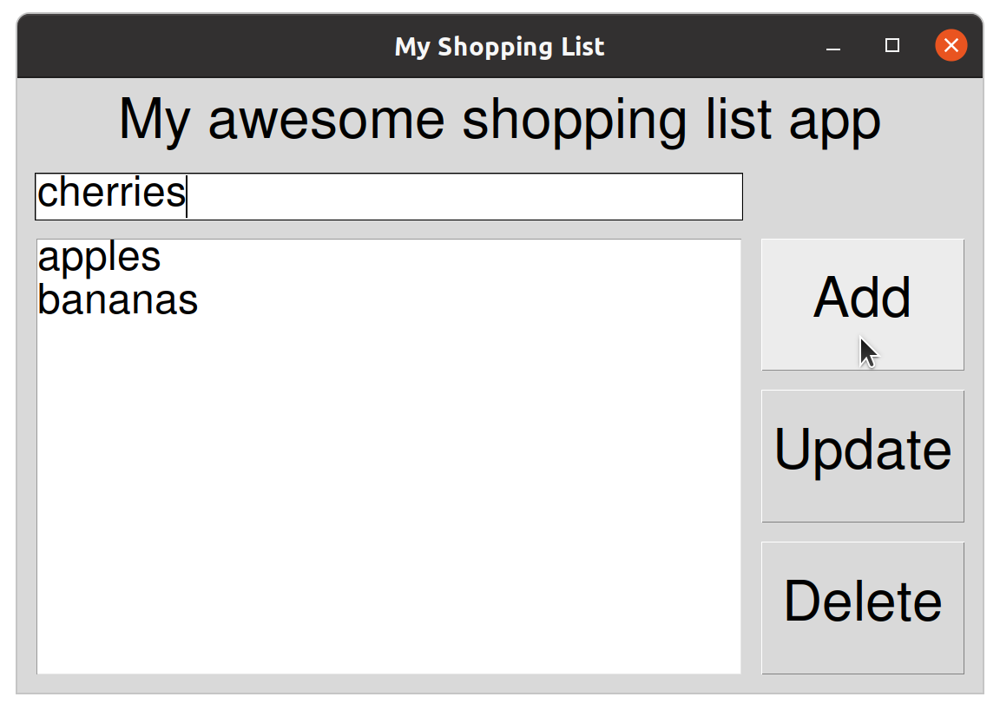
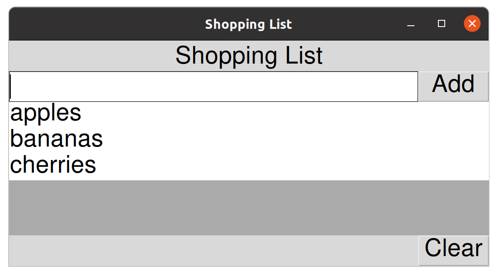

# Compound widgets and UI design

Last week we learned a lot about tkinter.
We built a working shopping list application which allowed us to manage a list of items.
We implemented features which allowed us to add new items, edit and delete existing items and in the challenges (as shown in the solution video) allowed our list to be saved to a file when the application was closed and loaded when the application was opened.



Our application is functional but the interface is neither intuitive nor convenient.
In this lab exercise, we will redesign out application with a more advanced user interface.

Consider the `update` functionality.
In order to edit an item we need to go through four steps and requires switching from mouse to keyboard and back to mouse:

1. select the item to edit
1. select the entry field
1. type a new value
1. click the 'Update' button

This is not ideal. 

>It is possible to use the `tab` key (usually near `Q` and `Caps Lock`) to navigate the widgets without the mouse.
Using the spacebar will click buttons.
But, even with this convenience, the interface is still 'clunky'.

Even simply deleting an item from the list requires two steps:

1. Select the item
1. Click the 'Delete' button

Adding an item is surprisingly complicated:

1. Select the entry field
1. Type a new value
1. Click the 'Add' button

All this adds up to a poor user experience.
Anything we can do to improve this (even just a tiny bit) will help our users to be more productive.

## We can do better

Let's reimagine the shopping list application. 
A key feature we would like to have is the ability to select an item from the list and edit it directly, in place.
Perhaps we can use `tk.Entry` widgets to enable this?

Another feature we would like is to be able to simply press enter when adding or editing an item to trigger the action.
We can bind keyboard events to event handlers.

Finally, it would be nice to have a delete button next to every item so we can easily delete an item with one click.
So, each `tk.Entry` widget needs an associated `tk.Button`.

Fundamentally, the `tk.Listbox` widget doesn't allow us to do this.
All it can do is present a list.
There is no way to add anything other than simple text into a listbox widget.
So, we will replace our Listbox with a `tk.Frame` (basically a container widget).
This will allow us to build dynamic content and place it inside the frame.

<table class="app">
    <tr>
        <td style="text-align: center;" colspan=2>Shopping List</td>
    </tr>
    <tr>
        <td class="entry"></td>
        <td style="width: 20px">Add</td>
    </tr>
    <tr>
        <td colspan=2 style="background-color: #aaa; height: 100px; text-align: center; font-size: 2em;">
            tk.Frame
        </td>
    </tr>
    <tr>
        <td></td>
        <td>Clear</td>
    </tr>    
</table>

Our new design includes five widgets in a two by four grid.
In the top row we have a simple `tk.Label` spanning two columns.
The second row has a `tk.Entry` and `tk.Button` to allow users to add new items.
The `tk.Frame` takes up the third row, spanning both columns.
Underneath the frame, we have also added a `tk.Button` in the second column to allow the user to clear the entire list.
Everything else, including editing and deleting items, will happen within the frame.
So our table of widgets looks like this:

| widget    | row | column | rowspan | columnspan |
|:----------|:---:|:------:|:-------:|:----------:|
| label     | 0   | 0      | -       | 2          |
| add_entry | 1   | 0      | -       | -          |
| add_btn   | 1   | 1      | -       | -          |
| frame     | 2   | 0      | -       | 2          |
| clear_btn | 3   | 1      | -       | -          |

Just as in last week's exercise, we can build these widgets in the application constructor (`self.__init__`).
We first need to create the data and widgets and then we place them using `grid()` and the values in the above table.
We can begin with something like this:

```python
import tkinter as tk

font = ('Helvetica', 20)

class ShoppingList(tk.Tk):
    def __init__(self):
        super().__init__()
        self.title("Shopping List")

        # variables
        self.new_item = tk.StringVar()

        # create widgets
        self.label = tk.Label(text="Shopping List", font=font)
        self.entry = tk.Entry(textvariable=self.new_item, width=30, font=font)
        self.add_btn = tk.Button(text="Add", command=self.add, font=font)
        self.frame = tk.Frame(bg="#aaa")
        self.clear_btn = tk.Button(text="Clear", command=self.clear, font=font)

        # layout widgets
        self.label.grid(columnspan=2, pady=(10, 0))
        self.entry.grid(row=1, column=0, sticky="nesw")
        self.add_btn.grid(row=1, column=1, sticky="nesw")
        self.frame.grid(sticky="nesw", columnspan=2)
        self.clear_btn.grid(column=1, sticky="nesw")

    def add(self):
        print('add command')

    def clear(self):
        print('clear command')

app = ShoppingList()
app.mainloop()
```

The result shouldn't be surprising, the frame widget has no contents and so takes up no space by default.


Try changing the size of the window. 
Notice that the widgets don't respond.
They just retain their original size and position.


When we increase the size of the window, we are creating extra space in the interface.
By default, none of the rows or columns will take this space.

### Flexible rows and columns

In order to allow our GUI to stretch to fit the window, we need to specify which rows and columns should be given the extra space.

We can do this by calling `widget.rowconfigure()` and `widget.columnconfigure()`.

In this case, we want row 2 (containing the frame) to be given all the extra vertical space.
Also column 0 (containing the entry and frame) should be given all the extra horizontal space.

We can specify this at the end of our `__init__` method.

```python
# configure rows and columns
self.rowconfigure(2, weight=1)
self.columnconfigure(0, weight=1)
```

Now you should see that the GUI stretches to fit the size of the window.

>We set the background colour of the frame to make it clear what is happening.

However, the empty frame still takes up no height by default.
We can fix this by setting a minimum size for the main window as follows (again, in the `__init__` method).

```python
self.minsize(500, 500)
```

Here we are setting the minimum height to 500px and our interface stretches accordingly.
The minimum width is also set. 
This has no effect on the default size since the entry and the buttons take up space by default.
However, you should find that the window cannot now be shrunk beyond these limits.


Great, we have a nice starting point for building a decent shopping list implementation.
Now we need to activate some of the familiar functionality.

## Adding items

When the user enters a value into the entry widget and clicks the 'Add' button, we want to see the entered item appear inside our frame and the entry widget should be cleared.

We will begin by experimenting with inserting simple `tk.Label` widgets dynamically to represent the items in our list.

Update the `add` method as follows:

```python
def add(self):
    """Add a new item to the end of the list"""
    item = self.new_item.get()
    if item:
        label = tk.Label(text=item, font=font)
        label.grid()
        self.new_item.set("")
```

Running the application and adding a few items to the list reveals that the new label widgets are being appended to the end of the main window (inside the first column).


This is not good!
We want the system to create the label *inside* our frame.
To do this we need to pass in `self.frame` as the first argument to the `tk.Label` constructor.

Update the `add` method with this.

```python
label = tk.Label(self.frame, text=item, font=font)
```

>All widgets take this optional `parent` argument.
Until now, we have been creating all our widgets inside the top level window. 
We didn't need to manage any nesting because this is the default behaviour.
>
>Its good practice to always provide a `parent` widget (or top-level window).

Now, when we add items, they are inserted inside the frame.


>This is unexpected.
The labels are clearly center aligned but they are not taking the full width of the frame.

There are a few issues we need to sort out here. 
We want the labels to have a white background and the label text should be left aligned.

We can configure the labels easily enough by setting `anchor` (to left align the text) and `bg` (the background colour).
See the [documentation for labels](https://anzeljg.github.io/rin2/book2/2405/docs/tkinter/label.html) for details.

```python
label = tk.Label(self.frame, text=item, font=font, anchor=tk.W, bg="white")
```

Plus we need to set the `sticky` attribute when calling grid to make the label stretch to take the full width.

```python
label.grid(sticky="nesw")
```


OK, nearly there.
The labels are placed within the first (and only) column of the frame.
But the column doesn't cover the entire width of the frame.
In fact, it's taking up the minimum possible space within the frame.

If we want to configure the column to take up all the available space, we need to specify this when we configure the frame.

Add this to the end of your `__init__` method.

```python
self.frame.columnconfigure(0, weight=1)
```

This tells the frame that its first (and only) column should be given all the extra space available inside the parent frame.
The GUI should now resize well.



>feel free to experiment with formatting the padding, colours and fonts of the various widgets.

Finally, we want to trigger the `add` method whenever the return key is pressed *inside* the entry widget. 
We can do this with an additional line of code at the end of the `__init__` method. 

```python
# events
self.entry.bind("<Return>", lambda e: self.add())
```

The code is *binding* our `add` method to the `<Return>` event of the `self.entry` widget.
Basically, this will automatically call the `add` method whenever the return key is pressed from inside the widget.

>We are wrapping our function call in a `lambda` function.
>```python
>lambda e: self.add()
>```
>This is shorthand for a named function like this:
>```python
>my_event_handler(e):
>   self.add()
>```
>We could have declared the above function and bound it to the `<Return>` event like this.
>```python
>self.entry.bind("<Return>", my_event_handler)
>```
>The only reason we need to do this wrapping is because we want to ignore the argument (`e`) passed into the event handler by `tkinter`.
>This allows our `add` method to remain unchanged, taking no arguments.

## Clearing the list

To clear the list we will need to remove the label widgets from the application.
We can do this by calling the `destroy()` method on each label in turn.
However, we don't currently have any way to do this for our label widgets because we don't have a reference to them.  We need to retain a reference to the labels we are adding so we can call the `destroy()` method on each of them.

In the `__init__` method, create a new `self.items` attribute to store the label widgets in a list.
You can add this in the section we labelled with the comment `'# variables'`.

```python
self.items = []
```

Now, whenever we add a new item, we should also append it to the new list.
Insert this single line into the `add` method to do this.

```python
def add(self):
    """Add a new item to the end of the list"""
    item = self.new_item.get()
    if item:
        label = tk.Label(self.frame, text=item, font=font, anchor=tk.W, bg="white")
        self.items.append(label) # <- this
        label.grid(sticky="news")
        self.new_item.set("")
```

Now, every time we add a new item, the resulting label widget will be added to our `self.items` list and will be available to our code.
To clear the list, we should be able to loop over `self.items` and call `destroy()` on each label in turn before replacing the list with an empty one. 

Let's do this in our `clear` method.

```python
def clear(self):
    for label in self.items:
        label.destroy()
    self.items = []
```

Try it. 
You should now be able to clear the list by clicking the 'Clear' button.

## An 'empty list' message

You might notice that the frame doesn't know how to resize itself when the list is cleared.
We can fix this with an 'empty list' message similar to our command line equivalent.
We will add a new label which we will only show when the list is empty.

>We can create widgets behind the scenes and show/hide them as we please.
>Using `grid()` and `grid_remove()` is one way to do this.
>`grid_remove()` will remove the widget from the grid without destroying the widget.

To do this we can begin by creating a label along with the other *widget creation* code in the `__init__` method.
We pass the frame as the parent, just like we did with our item labels.

```python
self.empty_label = tk.Label(self.frame, text="\nThe list is empty\nadd some items to begin.\n", font=font)
```

>Our `self.empty_label` widget will be used only when the list is empty.

With the *layout* code in the `__init__` method, we can call `grid()` on our label with parameters to initialise it's layout.

```python
self.empty_label.grid(sticky="nesw", padx=50, pady=50)
```

>Calling `grid()` registers the widget in the app layout.

Now running the app shows the `empty_label` widget inside our frame.


But the label should disappear when we add our first item.

When we add an item, in our `add` method, we need to remove our `empty_label` widget **without** destroying it.
We do this by calling the `grid_remove()` method.

```python
def add(self):
    """Add a new item to the end of the list"""
    item = self.new_item.get()
    if item:
        label = tk.Label(self.frame, text=item, font=font, anchor=tk.W, bg="white")
        self.items.append(label)
        label.grid(sticky="news")
        self.new_item.set("")
        self.empty_label.grid_remove() # <- new
```

Calling `grid_remove()` on a widget simply removes it from the grid layout, so it disappears. 
Although it still exists and its grid parameters are remembered, its just not shown.
It can be shown again, in its correct position by calling `grid()` on it.

>Compare this to `destroy()` which actually removes the widget from the app entirely.

Subsequently, when the list is cleared, we can call `grid()` without parameters and the geometry manager will remember where it should be positioned.


```python
def clear(self):
    for label in self.items:
        label.destroy()
    self.items = []
    self.empty_label.grid() # <- new
```

>`grid_forget()` acts in a similar way to `grid_remove()` but *forgets* the grid parameters.

Now you should find that adding and removing items works fine and our message shows whenever the list is empty.

## Deleting an item

Last week, to delete an individual item the user needed to first select an item and then click the generic delete button.
We can improve this by adding a small delete button to every item.
In this way, the user simply clicks the appropriate delete button to remove an item.

For this, we could manage a list of buttons along with our list of labels but this would be complicated. Its much nicer (and perhaps easier) to develop a custom widget.

### A custom widget

We will design our own custom `ShoppingItem` widget to represent an item in our list.
The widget will consist of a `tk.Label` containing the text of the item and a `tk.Button` which will allow us to delete the item.

<table class="app">
    <tr>
        <td class="entry">item_label</td>
        <td style="width: 10px">×</td>
    </tr>
</table>

This is known as a compound widget.
We will insert multiple instances of our `ShoppingItem` widget into the container frame to represent our list.

<table class="app">
    <tr>
        <td style="text-align: center;" colspan=2>Shopping List</td>
    </tr>
    <tr>
        <td class="entry"></td>
        <td style="width: 20px">Add</td>
    </tr>
    <tr>
        <td colspan=2 style="padding: 2px">
            <table style="width: 100%">
                <tr>
                    <td class="entry">apples</td>
                    <td style="width: 10px">×</td>
                </tr>
                <tr>
                    <td class="entry">bananas</td>
                    <td style="width: 10px">×</td>
                </tr>
                <tr>
                    <td class="entry">cherries</td>
                    <td style="width: 10px">×</td>
                </tr>
            </table>
        </td>
    </tr>
    <tr>
        <td></td>
        <td>Clear</td>
    </tr>
    
</table>

Each time the user adds a new item, we will insert a new `ShoppingItem` widget (instead of the `tk.Label`) into the frame.
Each `ShoppingItem` will be wrapped in it's own `tk.Frame` so it only takes a single column within the main `tk.Frame`.

We can update our `add` method in anticipation.
Replacing the `tk.Label` with a `ShoppingItem` widget.
This is what it currently looks like.

```python
def add(self):
    """Add a new item to the end of the list"""
    item = self.new_item.get()
    if item:
        label = tk.Label(self.frame, text=item, font=font, anchor=tk.W, bg="white")
        label.grid(sticky="nesw")
        self.items.append(label)
        self.new_item.set("")
        self.empty_label.grid_remove()
```

To create an instance of our new `ShoppingItem` widget we need to replace this line.

```python
label = tk.Label(self.frame, text=item, font=font, anchor=tk.W, bg="white")
```

Obviously we don't want to call the `ShoppingItem` widget *'label'*.
It makes sense to call it something like *'item'*.
But we already have a variable called *'item'* within the function.

So we need to refactor. 

>It's always a good idea to refactor your variable names when something like this happens.
Avoid names like *'item2'* or meaningless names.
Variables should always be named in a way that feels natural.

In this case, the value we get from the entry widget is renamed to *'text'* and the widget is renamed to *'item'*.

>You may have better ideas.

So we can update our method to this.

```python
def add(self):
    """Add a new item to the end of the list"""
    text = self.new_item.get()
    if text:
        item = ShoppingItem(self.frame, text=text)
        item.grid(sticky="nesw")
        self.items.append(item)
        self.new_item.set("")
        self.empty_label.grid_remove()
```

Note that we changed five lines and that we are presuming an API for our `ShoppingItem` class constructor method.
We are assuming that we will set all the label parameters within the widget constructor method.
So all the widget needs to know is where it should place itself (`self.frame`) and the label text it should use (`text=text`).

Now we need to define the widget class itself.
We will extend the `tk.Frame` class to do this.
We will start by simply adding a label and a button and calling `grid()` on both.

```python
class ShoppingItem(tk.Frame):
    def __init__(self, parent, text):
        super().__init__(parent)
        self.label = tk.Label(self, text=text, font=font, anchor=tk.W, bg="white")
        self.button = tk.Button(self, text="×", font=font)
        self.label.grid()
        self.button.grid()
```

>The button text is a single utf-8 multiplication symbol, "×".

So basically our new widget *is* a `tk.Frame`.
It's a customised `tk.Frame` that automatically places some widgets inside itself.
This is why we can pass `self` into the label and button constructors as the `parent` argument. 
Because `self` *is* the frame which wraps our custom widget.

Try adding a few items and we can see that each of our `ShoppingItem` widgets is self-contained.
But the label and button widgets are not positioned how we want them.


We need to use the `column` and `row` arguments to place the label and button on a single row within our custom widget.

```python
class ShoppingItem(tk.Frame):
    def __init__(self, parent, text):
        super().__init__(parent)
        self.label = tk.Label(self, text=text, font=font, anchor=tk.W, bg="white")
        self.button = tk.Button(self, text="×", font=font)
        self.label.grid(row=0, column=0)
        self.button.grid(row=0, column=1)
```


Much better, but we have a familiar problem. 
We should tell the `ShoppingList` widget to stretch column 0 when there is extra space.
We do this with `columnconfigure`.

```python
class ShoppingItem(tk.Frame):
    def __init__(self, parent, text):
        super().__init__(parent)
        self.label = tk.Label(self, text=text, font=font, anchor=tk.W, bg="white")
        self.button = tk.Button(self, text="×", font=font)
        self.label.grid(row=0, column=0)
        self.button.grid(row=0, column=1)
        self.columnconfigure(0, weight=1)
```


Great, but the label is positioned in the middle of the grid cell by default.
We forgot to tell the label to expand to fill its grid cell.

Add the `sticky` argument to the call to `self.label.grid()`

```python
class ShoppingItem(tk.Frame):
    def __init__(self, parent, text):
        super().__init__(parent)
        self.label = tk.Label(self, text=text, font=font, anchor=tk.W, bg="white")
        self.button = tk.Button(self, text="×", font=font)
        self.label.grid(row=0, column=0, sticky="nesw")
        self.button.grid(row=0, column=1)
        self.columnconfigure(0, weight=1)
```


OK, now we have a sensible looking shopping list with buttons to delete each item.

As we know, we need to set a `command` argument on the button to a method which will be triggered when the button is pressed.
We need a method that will delete the `ShoppingItem` instance from the application.
Let's call it `self.delete`.
Update the button as follows:

```python
self.button = tk.Button(self, text="×", font=font, command=self.delete)
```

Now we can add a `delete` method to test it works.
We'll start by seeing if we can print the item label text when the delete button is clicked.

```python
def delete(self):
    print(self.label['text'])
```
>It turns out we can access the text of a label with dictionary-like indexing.

If you try this, you should find that it works perfectly.

### Refactoring

Now we need to actually trigger the removal of the list item.
This is interesting because we know the `ShoppingList` class is responsible for managing it's `self.items` list.
So it should be responsible for doing the delete operation.
But we are triggering the delete operation from the button in the `ShoppingItem` class.

>Pay attention here.
>We are about to refactor our code to make the task easy.
>
>Re-read the above paragraph.
>If you understand what we do next, then you understand something important.

So when the delete button is pressed, our `ShoppingItem` instance (which represents 'apples' for example and has the delete button built in) needs to inform the parent `ShoppingList` instance (the entire application) that *it* (the `ShoppingItem` representing 'apples') should be deleted.

Put another way, rather than destroying itself, the `ShoppingItem` is better off calling something like a `ShoppingList.delete()` method and passing itself (literally `self`) as the argument. 

>If the `ShoppingItem` tried to delete itself by calling `self.destroy()` it would leave a reference to itself in the `ShoppingList.items` attribute.
There are bad ways to do this that would work.

To enable this, we need to refactor our code slightly.
Our `ShoppingItem` instances need access to the parent `ShoppingList` in order to call the proposed `ShoppingList.delete()` method.

So the first thing we will do is change the `ShoppingList.add()` method so our `ShoppingList` passes a reference to itself into all the newly created `ShoppingItem` instances.

```python
def add(self):
    """Add a new item to the end of the list"""
    text = self.new_item.get()
    if text:
        item = ShoppingItem(self, text=text)
        item.grid(sticky="nesw")
        self.items.append(item)
        self.new_item.set("")
        self.empty_label.grid_remove()
```

>Notice the difference, we now pass `self` rather than `self.frame` into the `ShoppingItem` constructor.
So our items have access to the entire `ShoppingList` interface.

This change requires a small tweak to the first few lines of the `ShoppingItem` constructor.
Rather than receiving a `tk.Frame` instance, we now receive the `ShoppingList` instance which has the `self.frame` attribute.

```python
def __init__(self, shopping_list, text):
    super().__init__(shopping_list.frame)
    self.shopping_list = shopping_list
    self.label = tk.Label(self, text=text, font=font, anchor=tk.W, bg="white")
    self.button = tk.Button(self, text="×", font=font, command=self.delete)
    self.label.grid(row=0, column=0, sticky="nesw")
    self.button.grid(row=0, column=1)
    self.columnconfigure(0, weight=1)
```

We have renamed the `parent` argument to `shopping_list` to reflect the change.

>We now pass `shopping_list.frame` into the inherited `tk.Frame` constructor as the parent widget.
Remember, `ShoppingList.frame` is the `tk.Frame` widget where the `ShoppingItem` widgets live in the application.

The most important change (and the reason for the refactor) is that we can now store a reference to the `ShoppingList` as `self.shopping_list`.

Let's now update our `ShoppingItem.delete()` method to hand over responsibility to a proposed `ShoppingList.delete()` method.

```python
def delete(self):
    self.shopping_list.delete(self)
```

>This code is on the `ShoppingItem` class, in a moment we will implement the `delete` method on the `ShoppingList` class too. 

This is an important piece of code, it tells the application to 'delete this item', where 'this item' is `self`. 

>The clicked button is part of the `ShoppingItem` class.
>It has a reference to the parent application, so it can now easily request to be deleted.
>
>This is an important idea.
>Each part of the system has its own responsibilities.
>Only the `ShoppingList` class needs to know how to delete an item from the list.

Let's implement the `ShoppingList.delete()` method.
In order to delete an item, we need to call `destroy()` on the widget itself and remove the widget from the list.

```python
def delete(self, item):
    self.items.remove(item)
    item.destroy()
```
>Remember, this goes on the `ShoppingList` class

We have implemented a method that takes an argument called `item`.
We use the [list.remove()](https://docs.python.org/3/tutorial/datastructures.html) method to find and remove the item.

>If the item was not on the list, this would raise an error. 
However, this situation will never arise.

Finally we call `item.destroy()` to actually delete the widget from the application entirely.
You should now be able to delete any item by clicking it's delete button.

One last thing we should do is check to see if we have removed the last item.
If we leave the list empty, then we should show the `self.empty_label` widget.

```python
def delete(self, item):
    self.items.remove(item)
    item.destroy()
    if not self.items:
        self.empty_label.grid()
```


# Challenges

OK, we have built the main application.
Here are a few challenges to test how well you understand what we have done.

## Editing an item

Its not possible to directly edit a label widget.
So the easiest thing to do here is to replace the label with an entry widget.

>Don't worry, this is actually a fairly trivial change.

## Saving and loading the list

As in previous weeks, we need our application to load a file on startup and save back to the file on exit.
You may want to review last week's solution to get this to work.
Although there are significant differences.

>Hint: Remember, an entry widget can be assigned a `textvariable` to make the data accessible.
>
>Something like this in the `ShoppingItem` constructor:
>```python
>self.text = tk.StringVar(self.shopping_list, text)
>```
>will allow something like this in the `ShoppingList`:
>```python
>def save(self):
>    with self.path.open('w') as f:
>        for item in self.items:
>            print(item.text.get(), file=f)
>```
