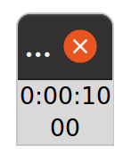
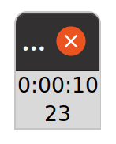
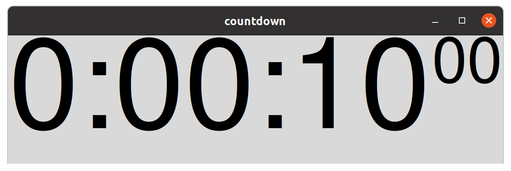
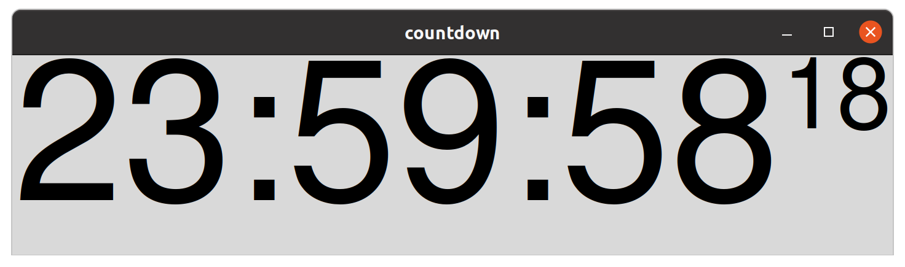
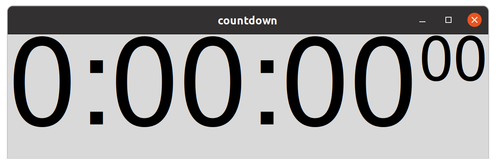

# Lab_06: The datetime module

This lab is an opportunity to practice our GUI programming with a very simple example.
Starting again from a blank file, we will build an application from scratch and solve problems as we go.

We will introduce the `datetime` module and develop a very simple programme (a countdown timer) which we will turn into a simple graphical interface using tkinter.
Our programme will be set with a given number of seconds and count down to zero.

<figure>
</img>
<figcaption>We want to build something a bit like this</figcaption>
</figure>

So, our application will need to automatically update itself as time passes.
To do this, we will introduce one new `tkinter` feature, the [after](https://anzeljg.github.io/rin2/book2/2405/docs/tkinter/universal.html) method which allows us to register a method to call `after` a given number of milliseconds.

But first, we will introduce the [datetime](https://docs.python.org/3/library/datetime.html) module.

## Dates

We will start by printing today's date.

```python
import datetime
print(datetime.date.today())
```

The output is as follows (obviously depending on what the current date is):

```
2021-11-04
```

Notice that we import the `datetime` module but then we are accessing the `today()` method of the `datetime.date` class.
An alternative and perhaps clearer approach is to make our import statement more specific and only import the `date` class.

```python
from datetime import date
print(date.today())
```


Let's have a deeper look at the `date` object returned by the `date.today()` method.

```python
from datetime import date

# create a date instance
today = date.today()

print(type(today))
print(today)
print(f'year: {today.year}')
print(f'month: {today.month}')
print(f'day: {today.day}')
```

The output is as follows:

```
<class 'datetime.date'>
2021-10-14
year: 2021
month: 11
day: 4
```

>Note that the `date`, `datetime` and `time` classes intentionally break the conventions of [PEP8](https://www.python.org/dev/peps/pep-0008/) by not starting with a capital letter. 
This is because they are designed to align with the python standard types (`list`, `dict`, `int`, `set`, `float` etc.) which are all lowercased.

We can also create a `date` object representing any date we choose.
Just specify the year, month and day as arguments when creating the date object.

```python
from datetime import date

# create a date instance
may_the_forth = date(2022, 5, 4)

print(type(may_the_forth))
print(may_the_forth)
print(f'year: {may_the_forth.year}')
print(f'month: {may_the_forth.month}')
print(f'day: {may_the_forth.day}')
```

We can also change the year, month or day of a date object using the `date.replace` method.

```python
from datetime import date

# create a date instance
today = date.today()

# create another date instance
this_date_next_year = today.replace(year=today.year+1)

# create another date instance
first_of_the_month = today.replace(day=1)

print(today)
print(this_date_next_year)
print(first_of_the_month)
```

This produces the following output:

```
2021-11-04
2022-11-04
2021-11-01
```

What if we don't like the `YYYY-MM-DD` formatting?
No problem, we can use `strftime` with [format codes](https://docs.python.org/3/library/datetime.html#strftime-and-strptime-format-codes).

```python
from datetime import date

today = date.today()
print(today.strftime("%d/%m/%Y"))
```

Generates the output
```
04/11/2021
```

>`strftime` can be read as `string formatted time`.

or even better... use an `f-string`

```python
from datetime import date

today = date.today()
print(f"today is {today:%d/%m/%Y}")
```
Which produces this output

```
today is 04/11/2021
```

If we start with a string (e.g. loaded from a text file) and want to convert it to a date, we can use `datetime.strptime` to *parse* a date from the string.

```python
from datetime import datetime

date_string = "Wednesday the 15th of June 2011"

# parse the string into a date
dt = datetime.strptime(date_string, "%A the %dth of %B %Y")

# convert the date into a differently formatted string
print(f"{dt:%d-%m-%Y (%a)}")
print(type(dt))
```
output:
```
15-06-2011 (Wed)
<class 'datetime.datetime'>
```

>We will be ignoring timezones in order to keep things simple, but be aware that the datetime module can handle timezones too.

## The datetime class

In the above example, we used the `strptime` method of the `datetime` class as a constructor.
As you might imagine, `datetime` objects represent a date and a time and are actually more common than `date` objects.

A classic example of using datetime objects is when timing how long a piece of code takes to run.

For example:

```python
from datetime import datetime

start = datetime.now()
a = 0
for i in range(1000000):
    a += i
end = datetime.now()
print(a)
print(start)
print(end)
print(end - start)
```
My output looked like this:
```
499999500000
2021-11-04 10:06:43.923291
2021-11-04 10:06:44.027607
0:00:00.104316
```
The code iterated one million times, adding a value each time, in around one tenth of a second.

## The timedelta object

When we subtracted one `datetime` from another, the result was a `timedelta` object representing a duration.

```python
from datetime import timedelta

one_hour = timedelta(hours=1)
five_minutes = timedelta(minutes=5)
print(type(one_hour))
print(one_hour)
print(five_minutes)

one_hour_five = one_hour + five_minutes
print(one_hour_five)
print(one_hour_five.total_seconds())
```
This produces the following output:
```
<class 'datetime.timedelta'>
1:00:00
0:05:00
1:05:00
3900.0
```

If we want to track time, we can implement a `while` loop.
Study the following code carefully.

```python
from datetime import datetime, timedelta

target = datetime.now() + timedelta(seconds=3)

while datetime.now() < target:
    print(target - datetime.now())
```

We are creating a `target` which is `datetime` representing three seconds into the future.

Then we enter a `while` loop which checks at each iteration whether the current time is less than (i.e. before) the `target` datetime.
If the target time has not been reached, we simply print out the time we have left to wait.

You should see an output which is something like this:

```
0:00:02.999990
0:00:02.999953
0:00:02.999946
0:00:02.999941
0:00:02.999936
0:00:02.999931
0:00:02.999926
... and lots more
```

The output goes on and on for three whole seconds before stopping.

We can see that each iteration is taking very little time.
So we end up printing thousands of lines per second.
If we want to reduce this, we can use the `time.sleep` method to wait at the end of each iteration.

```python
from datetime import datetime, timedelta
import time

target = datetime.now() + timedelta(seconds=3)

while datetime.now() < target:
    print(target - datetime.now())
    time.sleep(0.1)
```

Here we have waited one tenth of a second at the end of each iteration, so as we might expect, the output contains fewer lines and the gap between each line of output is more than a tenth of a second.

```
0:00:02.999988
0:00:02.899705
0:00:02.799450
0:00:02.698808
0:00:02.598414
0:00:02.497871
0:00:02.396968
... and lots more
```

>Increase the sleep time to half a second and you should get a much slower output like this:
>```
>0:00:02.999988
>0:00:02.499519
>0:00:01.998827
>0:00:01.497967
>0:00:00.997028
>0:00:00.496102
>``` 

We can also expand the code inside the loop to be more clear about what is going on here.

```python
from datetime import datetime, timedelta
import time

target = datetime.now() + timedelta(seconds=3)

while datetime.now() < target:
    td = target - datetime.now()
    print(td)
    time.sleep(0.5)
```

Notice that the variable `td` is a timedelta object.

In our GUI application, we need to format the output in a more user-friendly way.
Rather than including six digits after the decimal place (microsecond accuracy) we want to only show the hundredths of a second.
Something like you might see on a digital stopwatch.

> Look back at the image on page 1
> The minutes and whole seconds are presented in a larger font.
> The hundredths are presented in a smaller font.
> This will require two labels, each containing a carefully formatted string.

## Custom formatting for a timedelta object

We will now spend some time developing our own custom formatting code to generate the output we need. 
We need to convert a `timedelta` object (which we can calculate as we have above) into a pair of strings.
For example, a `timedelta` representing 4.083291 seconds, should be converted into two strings.

The first, covers the whole seconds:
```
'0:00:04'
```
The second represents the hundredths in two characters (zero-padded)
```
'08'
```
It's important that both strings are *always* the same length, so the user interface can be kept consistent.

We can start by handling the first part.

```python
from datetime import datetime, timedelta
import time

target = datetime.now() + timedelta(seconds=3)

while datetime.now() < target:
    td = target - datetime.now()
    s = td.seconds
    print(timedelta(seconds=s))
    time.sleep(0.5)
```

This was quite a simple move.
We accessed the `seconds` attribute of the `timedelta` object.
This contains all the whole seconds as an integer.
We then printed a new `timedelta` object which we created with the given number of seconds.

The output shows it has worked well.
> We are sleeping for half a second each time we print, so there are only a few lines of output.
```
0:00:02
0:00:02
0:00:01
0:00:01
0:00:00
0:00:00
```

Now we need to take the microseconds and convert them into a two-digit, zero-padded string.
We can start by simply printing the number.

```python
from datetime import datetime, timedelta
import time

target = datetime.now() + timedelta(seconds=3)

while datetime.now() < target:
    td = target - datetime.now()
    s = td.seconds
    ms = td.microseconds
    print(timedelta(seconds=s), ms)
    time.sleep(0.5)
```
All we have done is printed the microseconds as an integer after the first formatted string.
The output now includes the new number.

```
0:00:02 999969
0:00:02 499158
0:00:01 998330
0:00:01 497505
0:00:00 996595
```
Note that if you decrease the sleep time to e.g. 0.01 seconds then you will see output where the number of microseconds is less that a six-digit number (e.g. 3901 microseconds). 
This means we can't just convert to a string and take the first two digits, we need to calculate the hundredths first.

There are a number of ways we could convert this number into a string representing the hundredths.
We will do it by converting the number into a padded string and reading off the first two digits.


Our approach goes like this:

>Don't blindly type this, it's only a fragment of the code. The full listing is presented below.


```python
microseconds = td.microseconds
microseconds_as_a_string = str(microseconds)
microseconds_as_a_padded_string = microseconds_as_a_string.rjust(6, '0')
hundredths = microseconds_as_a_padded_string[:2]
```
>This method isn't particularly accurate, but is simple and 'good enough' for our purposes.
'Good enough' is an important concept in software engineering.
Though it can be difficult to define. 


The above code is four lines long and each line does one step in the processing.
But we can actually do this all on one line.

```python
hundredths = str(td.microseconds).rjust(6, '0')[:2]
```
>study this carefully, in one line we do all the steps shown in the four lines of code in the example above.
>
>There is no strict right or wrong way to do this, either way works.
The most important thing is that it makes sense to you (and future you, six months from now, or someone else reading your code).

Below is the complete code, refactored to be short and clear.


```python
from datetime import datetime, timedelta
import time

target = datetime.now() + timedelta(seconds=3)

while datetime.now() < target:
    td = target - datetime.now()
    seconds = timedelta(seconds=td.seconds)
    hundredths = str(td.microseconds).rjust(6, '0')[:2]
    print(seconds, hundredths)
    time.sleep(0.01)
```
>Notice we have reduced the sleep time to one hundredth of a second.

Presenting your code in a way that you can understand is a good idea.
If you think we are doing too much on one line, you could split it out into multiple lines and add comments like this.

```python
from datetime import datetime, timedelta
import time

target = datetime.now() + timedelta(seconds=3)

while datetime.now() < target:
    # calculate the remaining time
    td = target - datetime.now()

    # Extract the whole seconds
    seconds = td.seconds

    # create a new timedelta object
    seconds_delta = timedelta(seconds=s)

    # convert to a formatted string
    seconds_string = str(seconds_delta)

    # Extract the microseconds
    microseconds = td.microseconds

    # Convert to a string
    microseconds_as_a_string = str(microseconds)

    # Create a 6-character string, padded with zeros if needed
    microseconds_as_a_padded_string = microseconds_as_a_string.rjust(6, '0')

    # take the first two characters
    hundredths_string = microseconds_as_a_padded_string[:2]

    # print the bits we want
    print(seconds_string, hundredths_string)

    # sleep for a bit
    time.sleep(0.01)
```
> Remember, it's very important that you (and others, or you in six months time) can read and understand your own code. 
Using descriptive variable names can help to make your code clear.
But perhaps the above is a bit too much?
You decide.

## A basic countdown timer

Now we will build a very simple `tkinter` application based on what we have done above.

> You might want to create a fresh file for this and keep the commented version separately.

### A useful function

We can start by creating a function that does the necessary processing.

```python
from datetime import timedelta 

def format_output(td):
    seconds = timedelta(seconds=td.seconds)
    hundredths = str(td.microseconds).rjust(6, '0')[:2]
    return seconds, hundredths
```

This is implementing exactly what we worked on above in a reusable way.
Our function expects a `timedelta` object, `td` and returns a `timedelta` object and a string.

We can use it like this:

```python
# create a timedelta object
td = timedelta(seconds=23.45678)

# use our function to create two strings
seconds, hundredths = format_output(td)

# print the strings
print(seconds, hundredths)
```

>Add this temporarily to the end of your file, just to check.
>You should get this output:
>```
>0:00:23 45
>```

### A basic layout

Let's design our layout. 
We want to show the above information in a simple two-column layout like this.

<table class="app" style="min-width: 0">
    <tr style="height: 5em;">
        <td style="font-size: 5em; overflow: auto;">0:00:10</td>
        <td style="font-size: 2em; vertical-align: top;">50</td>
    </tr>
</table>

So, we need two labels.
Both labels are positioned in the first row.
We need the first label to be in column zero and it should have a much larger font.
The second label should be in column one and it should be smaller and pushed to the top of the row.

Now we can create a basic `tkinter` template with two labels.

```python
import tkinter as tk
from datetime import timedelta

small = ("Helvetica", 60)
large = ("Helvetica", 120)

def format_output(td):
    seconds = timedelta(seconds=td.seconds)
    hundredths = str(td.microseconds).rjust(6, '0')[:2]
    return seconds, hundredths

class Countdown(tk.Tk):
    def __init__(self, seconds):
        super().__init__()

        # set the window title
        self.title('countdown')

        # create a timedelta object
        td = timedelta(seconds=seconds)

        # convert it into our strings
        seconds, hundredths = format_output(td)

        # display two labels
        tk.Label(text=seconds, font=small).grid()
        tk.Label(text=hundredths, font=large).grid()

# pass in the number of seconds (10) 
app = Countdown(10)

# start the tkinter event loop to show the app
app.mainloop()
```

The above code should not contain any huge surprises.
We import `tkinter`.
We define a class `Countdown` inheriting from `tk.Tk` to act as the main window and we create an instance and call the `mainloop` method to start the GUI application.

The class has an `__init__` method and we have defined an argument `seconds` which will determine how many seconds to display. 
This argument is passed into the class when creating an instance.
In our case we have specified 10 seconds by calling `app = Countdown(10)`.

We set the window title and create a `timedelta` object with the provided number of seconds.

>In previous examples, we kept references to everything as attributes of `self`.
>In this example, we will only keep references to things we need.
>Right now, we don't need references to any of this stuff.

Finally, we use our function to generate the formatted output and pass the results into a pair of labels.
The labels have been given different font sizes.
Each label is positioned on the grid by calling `grid()` on it.

>Notice we have used a shortcut by creating the `tk.Label` and calling the `grid()` method on the same line.
>
>```python
>tk.Label(text=seconds, font=small).grid()
>tk.Label(text=hundredths, font=large).grid()
>```
>We are not keeping a reference to the labels because we won't need to refer to them again.
>
>tkinter will keep an internal reference to the widgets, so it won't be removed by the python garbage collector.

The result is a main window displaying a single label, showing the stringified `timedelta` object.



Obviously, it's not quite right yet (see the image on page 1). 
The font is tiny and the labels are positioned badly.
But we have presented the initial value of the countdown timer.
Now, try initialising the app with 10.2345 seconds and see what happens.



So, we can be confident that the labels will show pretty much any timedelta object we need.

### Some basic layout and styling

A few minor tweaks are all that is needed to position the labels correctly and set the fonts.


```python
import tkinter as tk
from datetime import timedelta

def format_output(td):
    seconds = timedelta(seconds=td.seconds)
    hundredths = str(td.microseconds).rjust(6, '0')[:2]
    return seconds, hundredths

small = ("Helvetica", 60)
large = ("Helvetica", 120)

class Countdown(tk.Tk):
    def __init__(self, seconds):
        super().__init__()

        # set the window title
        self.title('countdown')

        # create a timedelta object
        td = timedelta(seconds=seconds)

        # convert it into our strings
        seconds, hundredths = format_output(td)

        # display two labels
        label1 = tk.Label(text=seconds, font=large)
        label2 = tk.Label(text=hundredths, font=small)

        # layout the labels
        label1.grid(row=0, column=0)
        label2.grid(row=0, column=1, sticky="n")

# pass in the number of seconds (10) 
app = Countdown(10)

# start the tkinter event loop to show the app
app.mainloop()
```

>These changes should make sense based on our layout above.
We have specified the column and row in our calls to `grid()` to position the labels.
Notice we also set `sticky="n"` on the hundredths label grid position to make the label *stick* to the top of its cell.
We also specified the fonts to use.

The result is much better.
We can work with this.




## Activating the countdown

The final step will activate the countdown.
To do this, we need to update the counter regularly, a bit like we did earlier.

>remember this?
>```python
>from datetime import datetime, timedelta
>
>target = datetime.now() + timedelta(seconds=3)
>
>while datetime.now() < target:
>    print(target - datetime.now())
>```

Starting in our `__init__` method.
We calculate a `target` value based on adding the given number of seconds to `datetime.now()`.

```python
self.target = datetime.now() + timedelta(seconds=seconds)
```
>this requires us to update our import statement
>```
>from datetime import timedelta, datetime
>```

We then need to define some `tk.StringVar` objects to store the strings and set these as the `textvariable` arguments to our labels.

>These make our labels dynamically updatable

```python
self.seconds = tk.StringVar()
self.hundredths = tk.StringVar()

label1 = tk.Label(textvariable=self.seconds, font=large)
label2 = tk.Label(textvariable=self.hundredths, font=small)

label1.grid(row=0, column=0)
label2.grid(row=0, column=1, sticky="n")
```

Finally, we need a new update method, which we call at the end of the `__init__` method.

The new code looks like this.

```python
import tkinter as tk
from datetime import timedelta, datetime

def format_output(td):
    seconds = timedelta(seconds=td.seconds)
    hundredths = str(td.microseconds).rjust(6, '0')[:2]
    return seconds, hundredths

small = ("Helvetica", 60)
large = ("Helvetica", 120)

class Countdown(tk.Tk):
    def __init__(self, seconds):
        super().__init__()
        self.title('countdown')
        self.target = datetime.now() + timedelta(seconds=seconds)

        # create StringVar objects
        self.seconds = tk.StringVar()
        self.hundredths = tk.StringVar()

        # link the labels to the StringVar objects
        label1 = tk.Label(textvariable=self.seconds, font=large)
        label2 = tk.Label(textvariable=self.hundredths, font=small)
        label1.grid(row=0, column=0)
        label2.grid(row=0, column=1, sticky="n")

        self.update()

    def update(self):
        td = self.target - datetime.now()
        seconds, hundredths = format_output(td)
        self.seconds.set(seconds)
        self.hundredths.set(hundredths)

app = Countdown(10)
app.mainloop()
```

The next step is to call the update function regularly to keep the interface up to date.
We can do this by adding a single line to the end of the `update` method.

```python
self.after(10, self.update)
```

The [widget.after](https://anzeljg.github.io/rin2/book2/2405/docs/tkinter/universal.html) method will request that `tkinter` calls the given method after the given number of milliseconds.
In this case, we are requesting that once we have finished updating the labels, `tkinter` should wait at least 10ms (one hundredth of a second) before calling the `self.update` method again.

>Though this might look like a recursion, its actually not. 
>We are registering a method to be called later inside the tkinter event loop.

Now you should see that the counter is counting down!
Unfortunately, once the target is reached, there is nothing stopping the counter from continuing to pass negative values into our function and the result is not what we want.



So we need to change the `update` method to check whether we have reached the target.
We *only* want to continue updating *if* we have not yet reached the target.
Once we pass the target, we can set the labels to fixed values and stop updating.

```python
def update(self):
    td = self.target - datetime.now()
    if td.total_seconds() > 0:
        seconds, hundredths = format_output(td)
        self.seconds.set(seconds)
        self.hundredths.set(hundredths)
        self.after(10, self.update)
```

We only call `self.after` if there is time left on the countdown. 
Once the `target` time is reached, we stop calling the `self.update` method.

Once the timer runs out, the result is now acceptable.



>You may see an occasional glitch where one hundredth of a second remains.
Can you see why this occurs?
Can you fix it?

Here's the final code.

```python
import tkinter as tk
from datetime import timedelta, datetime

def format_output(td):
    seconds = timedelta(seconds=td.seconds)
    hundredths = str(td.microseconds).rjust(6, '0')[:2]
    return seconds, hundredths

small = ("Helvetica", 60)
large = ("Helvetica", 120)

class Countdown(tk.Tk):
    def __init__(self, seconds):
        super().__init__()
        self.title('countdown')
        self.target = datetime.now() + timedelta(seconds=seconds)

        # create StringVar objects
        self.seconds = tk.StringVar()
        self.hundredths = tk.StringVar()

        # link the labels to the StringVar objects
        label1 = tk.Label(textvariable=self.seconds, font=large)
        label2 = tk.Label(textvariable=self.hundredths, font=small)
        label1.grid(row=0, column=0)
        label2.grid(row=0, column=1, sticky="n")

        self.update()

    def update(self):
        td = self.target - datetime.now()
        if td.total_seconds() > 0:
            seconds, hundredths = format_output(td)
            self.seconds.set(seconds)
            self.hundredths.set(hundredths)
            self.after(10, self.update)

app = Countdown(10)
app.mainloop()
```

# Challenges

Our countdown application is very simple. 
Try to implement the following features by upgrading what we have.
Do your best to keep the code as simple as possible.

>Don't worry if you struggle with these. 
>Simple is **not** the same as easy.

## 1. Add a reset button

Add a button which calls a `self.reset` method to set the counter back to its original value.
>Hint: you will need to update the `target` variable.

## 2. Add a pause/play button

Give the user a way to pause and restart the counter.


