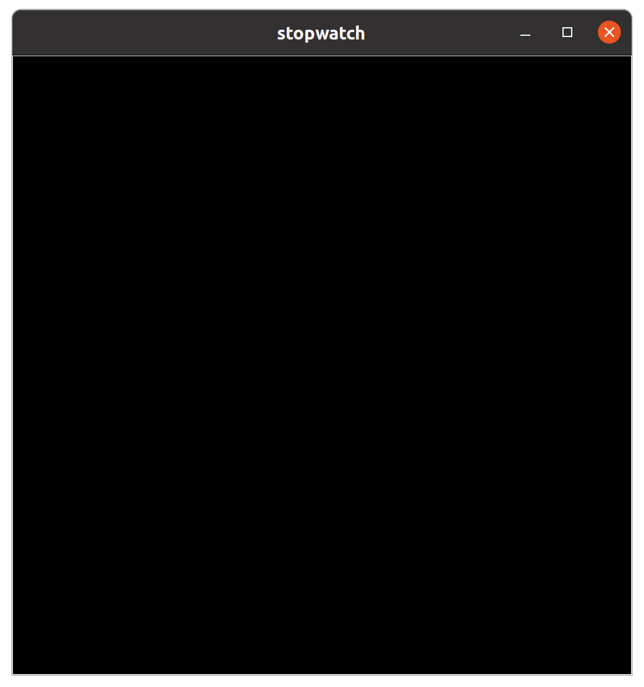
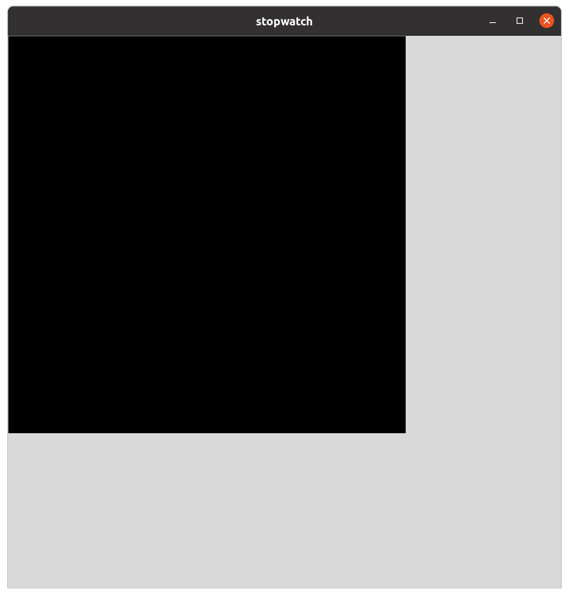
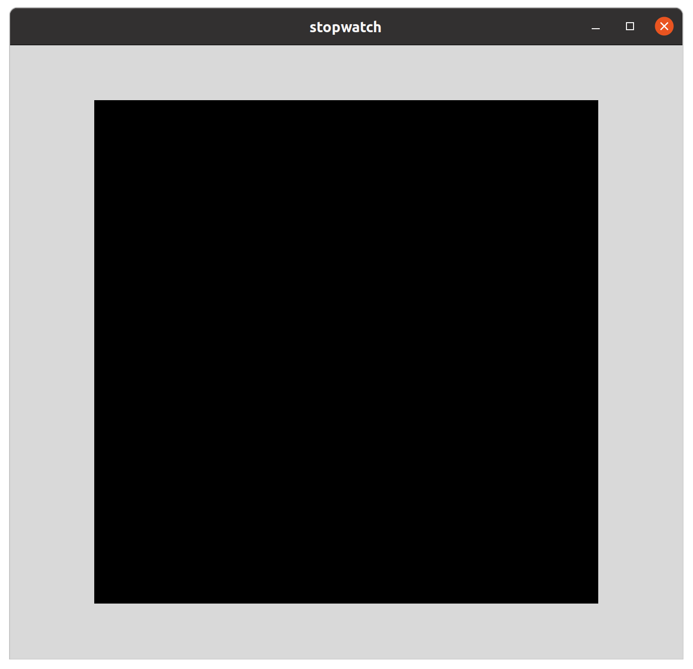
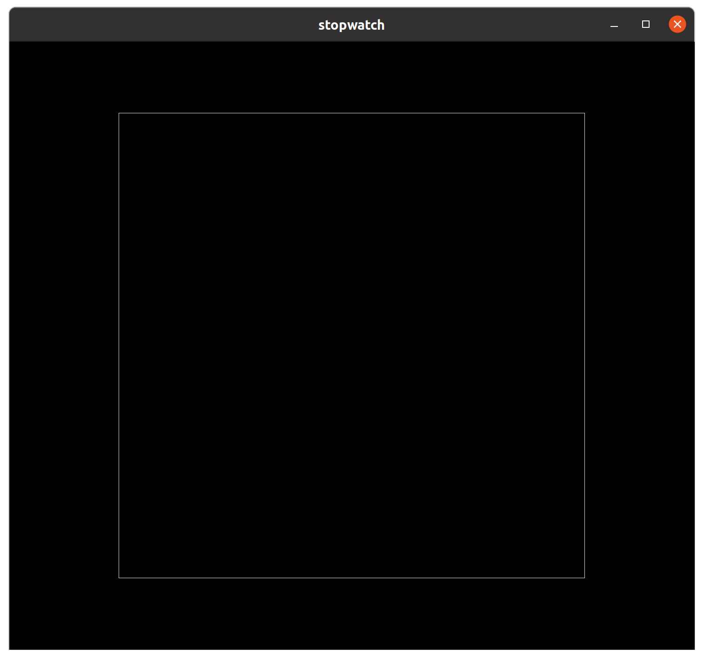
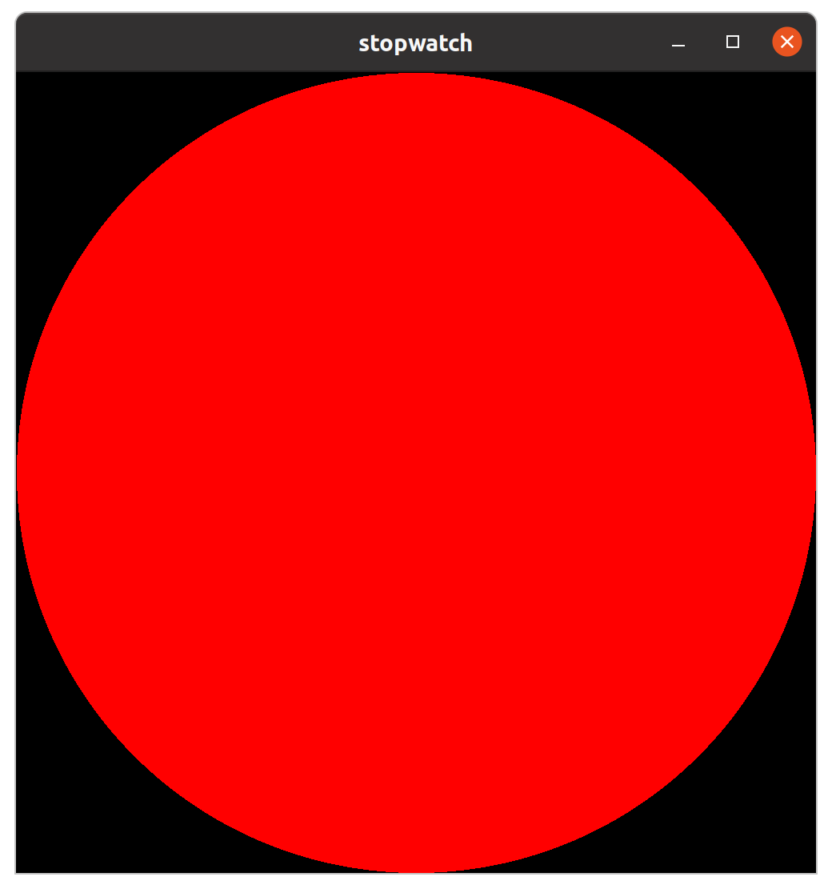
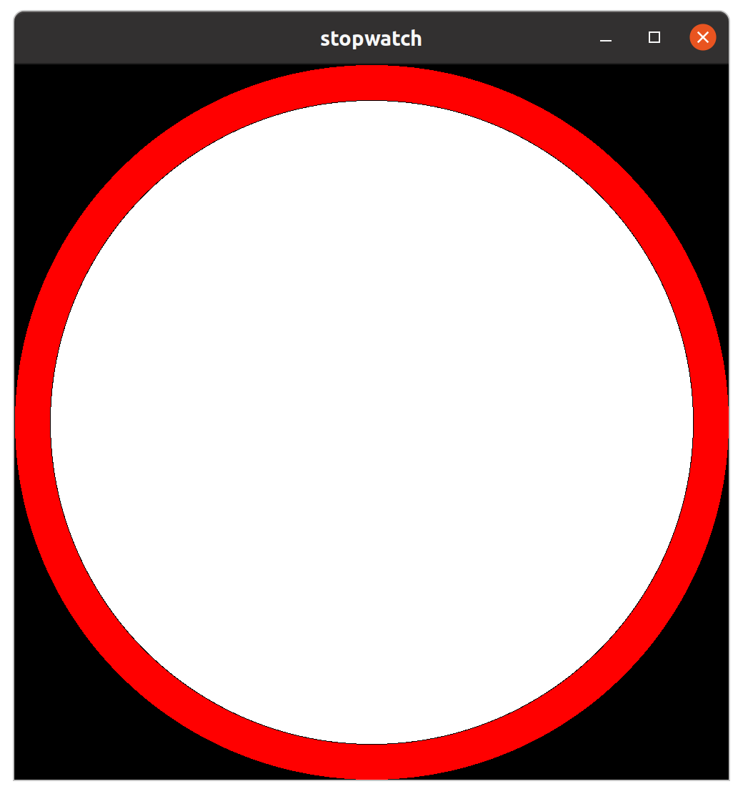
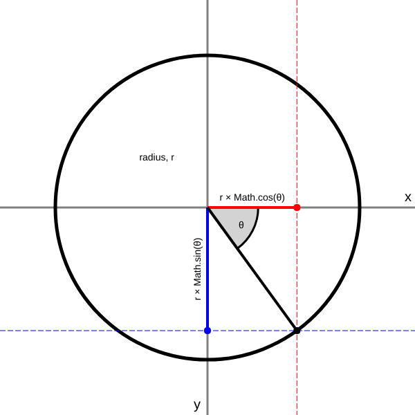
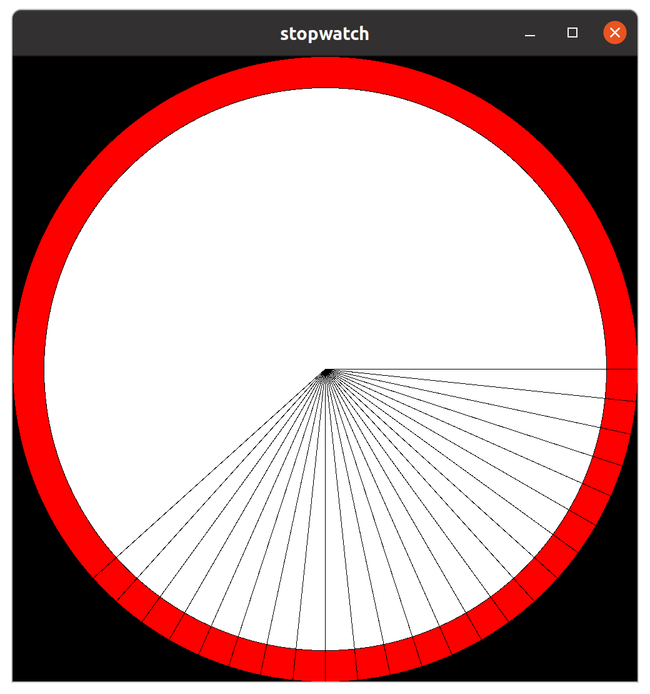
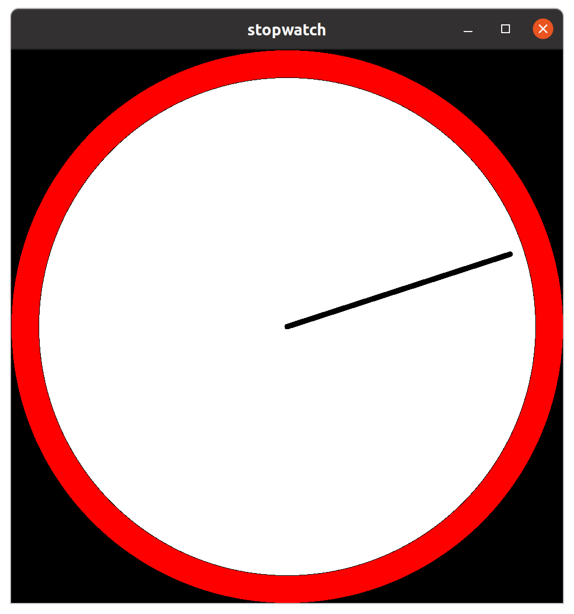

# Lab_07: The canvas widget

This week we will introduce the canvas widget.
The canvas widget provides an interface for drawing custom graphics into a widget which acts as a canvas for your drawing.

We will use the canvas widget to design our own analogue clock stopwatch which will behave similarly to last week's countdown example (but we will count upwards this time).

>Drawing requires a very basic understanding of trigonometry.
We will be using the sine and cosine functions from the `math` module.
If you are not comfortable with this then don't worry, we don't need to be experts in this to get something to work.
The reason we need it it because we want to convert angles and distances (polar coordinates) into heights and widths (cartesian coordinates).

We will start with a basic `tkinter` template.

```python
import tkinter as tk

class Stopwatch(tk.Tk):
    def __init__(self):
        super().__init__()
        self.title('stopwatch')

app = Stopwatch()
app.mainloop()
```

The above code does nothing interesting. 

>HINT: All tkinter programmes can start like this.
You might want to start with a template like this for your assignment work.
>
>Obviously (?) you should change the name of the class and the window title to something that makes sense for whatever you are building.

## A basic layout

We can add our canvas in the same way we add all components to our interface.
By simply creating a `tk.Canvas` object and calling `grid()`.

```python
import tkinter as tk

class Stopwatch(tk.Tk):
    def __init__(self):
        super().__init__()
        self.title('stopwatch')
        self.canvas = tk.Canvas(bg="black", width=1000, height=1000)
        self.canvas.grid()
 
app = Stopwatch()
app.mainloop()
```
>Consider making a copy of the file and use it for experiments.
>
>Feel free to change the background colour (`bg`), width or height of the canvas for example.

Now we have a canvas on which we will draw our clock.



But, if you change the window size, the canvas stays in the top-left corner of the window.
This is because the grid is shrinking to the smallest size it can around the canvas widget. 




This is the default behaviour.
The grid is not using the spare space within the window.

We need to tell our main window to give all the available space to the first row and column of the grid.
We will do this using `columnconfigure` and `rowconfigure`, setting `weight=1` on each.
This will tell the window to allocate all the spare vertical space to the first row and all the spare horizontal space to the first column.

>Using `columnconfigure` and `rowconfigure` can make your application feel a lot more professional.
>
>It's *definitely* worth seeing how your application responds to the user resizing the window.
Your programme is under your control and the default behaviour is rarely what you want here.

We also want the window to have a minimum width and height to match the canvas size.
This will prevent the canvas from being cropped when the window is shrunk.

```python
import tkinter as tk

class Stopwatch(tk.Tk):
    def __init__(self):
        super().__init__()
        self.title('stopwatch')

        # configure the window
        self.minsize(1000, 1000)
        self.columnconfigure(0, weight=1)
        self.rowconfigure(0, weight=1)
        
        self.canvas = tk.Canvas(bg="black", width=1000, height=1000)
        self.canvas.grid()

app = Stopwatch()
app.mainloop()
```

The result is that the window cannot be made smaller.
If the window is made larger, the canvas remains centered within our single grid cell.



However, we want to make the whole window the same colour as the canvas with our drawing in the middle. 
This will require two steps.
First, we can set the background colour of the window using `self.configure`.

>all widgets, including main windows have a `configure` method which allows us to set or change many parameters.

```python
import tkinter as tk

class Stopwatch(tk.Tk):
    def __init__(self):
        super().__init__()
        self.title('stopwatch')

        # configure the window
        self.configure(bg="black")
        self.minsize(1000, 1000)
        self.columnconfigure(0, weight=1)
        self.rowconfigure(0, weight=1)
        
        self.canvas = tk.Canvas(bg="black", width=1000, height=1000)
        self.canvas.grid()

app = Stopwatch()
app.mainloop()
```

The result shows that the canvas has a very clear border.
This is actually known as the `highlight`. 



So we also set the `highlightthickness` argument to zero into the canvas constructor.

>The line of code was getting a bit long, so we have broken it up so each argument has its own line.

```python
import tkinter as tk

class Stopwatch(tk.Tk):
    def __init__(self):
        super().__init__()
        self.title('stopwatch')
        self.configure(bg="black")
        self.minsize(1000, 1000)
        self.columnconfigure(0, weight=1)
        self.rowconfigure(0, weight=1)
        
        # We've broken this across multiple lines now
        self.canvas = tk.Canvas(
            bg="black", 
            width=1000, 
            height=1000, 
            highlightthickness=0
        )
        self.canvas.grid()

app = Stopwatch()
app.mainloop()
```

You should see that the canvas is now camouflaged nicely against a black background.

>If you chose different colours, obviously you need to align them.
>One way might be to create a `bg` variable and assign it to your background colour of choice.You can then use it to set the window and canvas background colours.
>This would make changing the background colour easy.

## Drawing on the canvas

OK, we need to draw a clock body.
We can start with a circle.
Again, we need to choose a colour.
But we also need to choose a size, and a position for our circle.

>Drawing to a canvas involves calling methods on the canvas object specifying coordinates.
>
>Coordinates are measured from the top-left of the canvas. 
To the coordinate (0, 0) is the top-left or 'origin'.
>
>Ovals (and circles) are drawn by calling [canvas.create_oval()](https://anzeljg.github.io/rin2/book2/2405/docs/tkinter/create_oval.html) specifying the corners of the 'bounding box' of an oval.
>```python
>canvas.create_oval(x0, y0, x1, y1)
>```
>Where `x0` and `y0` are the top-left coordinates and bottom-right coordinates of the 'bounding box'.
>
>In this first case, we will specify the whole canvas to be the bounding box for the body of our clock.
>So our coordinates will be (0, 0) and (1000, 1000).

```python
import tkinter as tk

bg = "black"

class Stopwatch(tk.Tk):
    def __init__(self):
        super().__init__()
        self.title('stopwatch')
        self.configure(bg=bg)
        self.minsize(1000, 1000)
        self.columnconfigure(0, weight=1)
        self.rowconfigure(0, weight=1)
        
        self.canvas = tk.Canvas(
            bg=bg, 
            width=1000, 
            height=1000, 
            highlightthickness=0
        )
        self.canvas.grid()

        # draw the clock
        self.canvas.create_oval(0, 0, 1000, 1000, fill="red")

app = Stopwatch()
app.mainloop()
```

We have specified a red filled oval that extends to the edges of our square canvas.
The result is a red circle that stays in the middle if we stretch the main window.




Looking at our code, we can see that we use the number `1000` several times.
In every case, it comes as a pair representing the width and the height of our window, our canvas and our clock.

We can refactor to allow these numbers to be set in one place.

```python
import tkinter as tk

bg = "black"
width = 1000    # set the values here
height = 1000   # set the values here

class Stopwatch(tk.Tk):
    def __init__(self):
        super().__init__()
        self.title('stopwatch')
        self.configure(bg=bg)
        self.minsize(width, height)
        self.columnconfigure(0, weight=1)
        self.rowconfigure(0, weight=1)
        
        self.canvas = tk.Canvas(
            bg=bg, 
            width=width, 
            height=height, 
            highlightthickness=0
        )
        self.canvas.grid()

        # draw the clock
        self.canvas.create_oval(0, 0, width, height, fill="red")

app = Stopwatch()
app.mainloop()
```

>Notice we can now change the dimensions of our clock easily and the whole app will respond accordingly.
>
>Try it.

Now we want to draw a slightly smaller circle inside our red circle to represent the actual face of the clock inside the red body.

>Again, obviously you can choose whatever colours (and dimensions) you want.

Before we get too complicated, we can split our drawing code out into a `draw_clock` method.
This will keep the related code together in a logical place and help us to keep our `__init__` method clear.

>Watch this step carefully, its very useful to do this in your own code whenever you feel like you are doing one job in multiple lines of code.
>
>In this case, we want to draw our blank clock face.
We will need to do this many times per second.
>
>We will also have a method for drawing the individual hands of the clock.

```python
import tkinter as tk

bg = "black"
width = 1000
height = 1000

class Stopwatch(tk.Tk):
    def __init__(self):
        super().__init__()
        self.title('stopwatch')
        self.configure(bg=bg)
        self.minsize(width, height)
        self.columnconfigure(0, weight=1)
        self.rowconfigure(0, weight=1)
        
        self.canvas = tk.Canvas(
            bg=bg, 
            width=width, 
            height=height, 
            highlightthickness=0
        )
        self.canvas.grid()

        self.draw_face()

    def draw_face(self):
        """draw the clock face"""
        self.canvas.create_oval(0, 0, width, height, fill="red")

app = Stopwatch()
app.mainloop()
```

We haven't added any functionality here. 
The code does exactly the same as before.
It draws a red circle.

>However, we have made it easier to show the code.
For the next few segments, we will only show the new `draw_face` function.

Add a white circle with a smaller bounding box.

```python
def draw_face(self):
    """draw the clock face"""
    self.canvas.create_oval(0, 0, width, height, fill="red")
    self.canvas.create_oval(50, 50, width-50, height-50, fill="white")
```

Notice we added 50 pixels to the top left coordinates and removed 50 pixels from the bottom-right coordinates.
Thus the circle is 50 pixels away from the edge of the canvas.



## Calculate the angles

In order to draw hands we will need to know how much time has passed since the programme started.
To do this we will record the `start` time and add an `update` function that uses a similar pattern to the previous exercise by calling `after` to execute itself regularly.

Here's our new code.

```python
import tkinter as tk
from datetime import datetime

bg = "black"
width = 1000
height = 1000

class Stopwatch(tk.Tk):
    def __init__(self):
        super().__init__()
        self.title('stopwatch')
        self.configure(bg=bg)
        self.minsize(width, height)
        self.columnconfigure(0, weight=1)
        self.rowconfigure(0, weight=1)
        
        self.canvas = tk.Canvas(
            bg=bg, 
            width=width, 
            height=height, 
            highlightthickness=0
        )
        self.canvas.grid()

        self.draw_face()

        self.start = datetime.now()
        self.update()

    def update(self):
        elapsed = datetime.now() - self.start
        print(elapsed)
        self.after(1000, self.update)

    def draw_face(self):
        """draw the clock face"""
        self.canvas.create_oval(0, 0, width, height, fill="red")
        self.canvas.create_oval(50, 50, width-50, height-50, fill="white")

app = Stopwatch()
app.mainloop()
```

We haven't added much here.
We import the `datetime` class from the `datetime` module and use it to initialise a value for `self.start`.
We also added a new `update` method that calculates the elapsed time (the time elapsed since `self.start` was initialised).
The `update` method prints this out and then calls itself after one second.
This infrastructure will allow us to update the clock regularly.

Starting with the second hand, we can extract the number of seconds from the `timedelta` object by calling `timedelta.seconds`.
However, you will find by experiment that the `timedelta` object stores only `days` and `seconds`. 

>Here's an example that demonstrates this
>```python
>from datetime import timedelta
>
>elapsed = timedelta(seconds=100000.0105)
>
>print("days", elapsed.days)
>print("seconds", elapsed.seconds)
>print("microseconds", elapsed.microseconds)
>```
>The `timedelta.seconds` attribute includes the total number of whole seconds (minus the whole days).
>```
>days 1
>seconds 13600
>microseconds 10500
>```

Obviously the value of the `timedelta.seconds` attribute will begin at zero and will increase over time.
Our seconds hand should begin pointing straight up and should rotate around the clock face eventually returning to its original position after 60 seconds.
To calculate exactly where the seconds hand should be, we need to use the `math` module to do some basic trigonometry.

First, we need to calculate the angle of the hand by dividing the number of seconds (ignoring the minutes and hours) by sixty and multiplying by 360 degrees (a full rotation).
We can use the modulo (`%`) operator to return the remainder of a division so the calculation is quite easy.

```python
def update(self):
    elapsed = datetime.now() - self.start
    angle = (elapsed.seconds % 60) / 60 * 360
    print(angle)
    self.after(1000, self.update)
```

>Let's go through this in detail.
>Imagine we have been running for 135 seconds.
>```python
>seconds = 135 % 60
>print(seconds)
>rotations = seconds / 60
>print(rotations)
>angle = rotations * 360
>print(angle)
>```
>This produces the following output:
>```
>15
>0.25
>90
>```
>We first calculate that the remainder is 15 seconds (i.e. 135 seconds is two whole minutes plus fifteen seconds).
>This value is the number of seconds we need to represent with the seconds hand.
>
>Then we divide the result by sixty to get the proportion of a full rotation covered.
>Fifteen seconds is a quarter (0.25) of a turn.
>
>Finally, we multiply this value by 360 degrees to calculate the angle in degrees.
>The final result is 90 degrees, a quarter turn (15 seconds).

## Drawing the seconds hand

We will replace the print statement with code that will draw the seconds hand as a simple line using the [canvas.create_line()](https://anzeljg.github.io/rin2/book2/2405/docs/tkinter/create_line.html) method.

In order to draw a line to the canvas we will need to specify the horizontal and vertical coordinates for the start and end points of the line.

The hand will start in the center of the clock, which is the center of our canvas.
The coordinates for the center of the canvas are easy to calculate, they are half the width and half the height. i.e. (500, 500) or (`width` / 2, `height` / 2).
The other end of the line will need to be pointing in the right direction.
This is where we will need to use trigonometry.



The diagram shows a circle with a radius `r`.
In our case, the radius is the length of the seconds hand.
So imagine, the seconds hand as a line from the center of the circle to the edge.
We have already calculated the angle, (denoted in the diagram as theta, ϑ). 
So we can see that the x (horizontal) coordinate can be calculated as `r * math.cos(ϑ)` and the y (vertical) coordinate can be calculated as `r * math.sin(ϑ)`.

>Its not necessary to understand why, just know that we can convert polar coordinates (angle and distance) to cartesian coordinates (x and y distances) using this method.

The resulting code is as follows:

```python
def update(self):
    elapsed = datetime.now() - self.start
    angle = (elapsed.seconds % 60) / 60 * 360

    # the radius (i.e. the length of the hand)
    r = 500

    # the relative x and y coordinates of the end of the hand
    x = r * math.cos(math.radians(angle))
    y = r * math.sin(math.radians(angle))

    # draw a line (shifting by 500 pixels to the center of the canvas)
    self.canvas.create_line(500, 500, 500 + x, 500 + y)

    self.after(1000, self.update)
```

and we have a form of success!



Obviously there are a few things to sort out here.
We want the hand to be shorter and probably thicker.
We also seem to be drawing a new line every time. 
It would be better if the hand moved and older versions were removed from the canvas.
We also have a problem that we expected the lines to begin pointing up, but apparently an angle of zero is equivalent to pointing to the right.

The main issue is that we are creating lines on the canvas every time update runs. 
This is inefficient, we should only create one line and simply change the coordinates at every step.
This is quite simple.

The first step is to create the line once in the `__init__` method as follows.

```python
def __init__(self):
    super().__init__()
    self.title('stopwatch')
    self.configure(bg=bg)
    self.minsize(width, height)
    self.columnconfigure(0, weight=1)
    self.rowconfigure(0, weight=1)
    
    self.canvas = tk.Canvas(
        bg=bg, 
        width=width, 
        height=height, 
        highlightthickness=0
    )
    self.canvas.grid()

    self.draw_face()
    self.second_hand = self.canvas.create_line(
        0, 0, 0, 0, 
        fill="black", 
        width=10, 
        capstyle=tk.ROUND
    )

    self.start = datetime.now()
    self.update()
```

>We create a line with the required parameters.
>
>We set the fill colour to black, the width of the line to 10 pixels and the [capstyle](https://anzeljg.github.io/rin2/book2/2405/docs/tkinter/cap-join-styles.html) to round (this adds rounded ends or `caps` to the line).

Our new `update` method has a few important tweaks. 
Firstly, we have taken 90 degrees off the angle calculation so zero seconds is now straight up.
We also shortened the value of `r` to 425.

```python
def update(self):
    elapsed = datetime.now() - self.start
    angle = (elapsed.seconds % 60) / 60 * 360 - 90
    r = 425
    x = r * math.cos(math.radians(angle))
    y = r * math.sin(math.radians(angle))
    self.canvas.coords(
        self.second_hand, 
        width / 2, 
        height / 2, 
        width / 2 + x, 
        height / 2 + y
    )
    self.after(10, self.update)
```

The biggest change is that we now call `canvas.coords` (see [here](https://anzeljg.github.io/rin2/book2/2405/docs/tkinter/canvas-methods.html)) and pass in the line reference (`self.second_hand`) along with the new calculated coordinates.
By calling this method, we are able to simply move the existing line rather than creating multiple new lines.

The result is a nice slim second hand with rounded ends that updates every second.



>Notice we also changed the update delay so we are updating every 10 milliseconds. 
This makes no difference now but it will be important when we add the millisecond hand.

## Multiple hands

To add a millisecond hand, we will need to add a new line to the `__init__` method.

```python
self.millisecond_hand = self.canvas.create_line(
    0, 0, 0, 0, 
    fill="black", 
    width=5, 
    capstyle=tk.ROUND
)
```
> We've made it a bit thinner here and we will make it a bit shorter too, because it moves quite fast.

Rather than repeating the same code with slightly different variables, we will extract out the hand moving code into a reusable method that does the main calculations.

```python
def move_hand(self, hand, angle, r):
    x = r * math.cos(math.radians(angle))
    y = r * math.sin(math.radians(angle))
    self.canvas.coords(
        hand, 
        width / 2, 
        height / 2, 
        width / 2 + x, 
        height / 2 + y
    )

```

This allows us to keep our `update` method relatively clean.

```python
def update(self):
    elapsed = datetime.now() - self.start
    seconds_angle = (elapsed.seconds % 60) / 60 * 360 - 90
    milliseconds_angle = elapsed.microseconds / 1000000 * 360 - 90
    self.move_hand(self.second_hand, seconds_angle, 425)
    self.move_hand(self.millisecond_hand, milliseconds_angle, 375)
    self.after(10, self.update)
```

>We are working with microseconds, but the hand is five pixels wide and the number of pixels on the screen is not enough to represent that level of detail, so we are renaming the hand the millisecond hand, though in fact, we are providing angles which are accurate to the microsecond.

We can do something very similar for the minutes hand.
Add a new line into the `__init__` method.

```python
def __init__(self):
    super().__init__()
    self.title('stopwatch')
    self.configure(bg=bg)
    self.minsize(width, height)
    self.columnconfigure(0, weight=1)
    self.rowconfigure(0, weight=1)
    
    self.canvas = tk.Canvas(
        bg=bg, 
        width=width, 
        height=height, 
        highlightthickness=0
    )
    self.canvas.grid()

    self.draw_face()
    self.millisecond_hand = self.canvas.create_line(
        0, 0, 0, 0, fill="black", 
        width=5, capstyle=tk.ROUND
    )
    self.second_hand = self.canvas.create_line(
        0, 0, 0, 0, fill="black", 
        width=10, capstyle=tk.ROUND
    )
    self.minute_hand = self.canvas.create_line(
        0, 0, 0, 0, fill="black", 
        width=20, capstyle=tk.ROUND
    )

    self.start = datetime.now()
    self.update()
```

We add a small tweak to the `update` method, this time using the floor division operator (`//`) to discard the remainder when we calculate the minute hand angle.

```python
def update(self):
    elapsed = datetime.now() - self.start
    milliseconds_angle = elapsed.microseconds / 1000000 * 360 - 90
    seconds_angle = (elapsed.seconds % 60) / 60 * 360 - 90
    minutes_angle = (elapsed.seconds // 60) / 60 * 360 - 90
    self.move_hand(self.millisecond_hand, milliseconds_angle, 275)
    self.move_hand(self.second_hand, seconds_angle, 425)
    self.move_hand(self.minute_hand, minutes_angle, 325)
    self.after(10, self.update)
```

# Challenges

The clock is a bit plain.
Add markers like this.


Now redesign the clock to make it your own.
